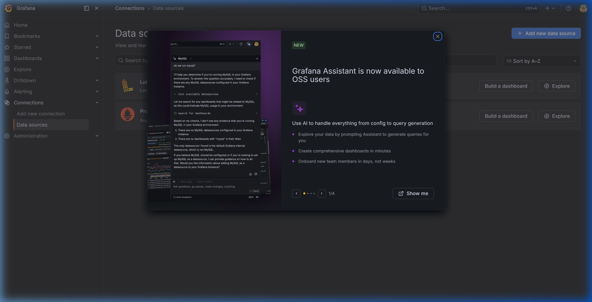

# 📚 Bookstore Microservices

Ứng dụng nhà sách trực tuyến được xây dựng theo kiến trúc **Microservices** sử dụng **Django**, **Django REST Framework** và **Docker Compose**.

---

## 📋 Mục lục

- [Tổng quan kiến trúc](#t%E1%BB%95ng-quan-ki%E1%BA%BFn-tr%C3%BAc)
- [Danh sách dịch vụ](#danh-s%C3%A1ch-d%E1%BB%8Bch-v%E1%BB%A5)
- [Yêu cầu hệ thống](#y%C3%AAu-c%E1%BA%A7u-h%E1%BB%87-th%E1%BB%91ng)
- [Cài đặt & Chạy dự án](#c%C3%A0i-%C4%91%E1%BA%B7t--ch%E1%BA%A1y-d%E1%BB%B1-%C3%A1n)
  - [Chạy bằng Docker (Khuyến nghị)](#1-ch%E1%BA%A1y-b%E1%BA%B1ng-docker-khuy%E1%BA%BFn-ngh%E1%BB%8B)
  - [Chạy từng service thủ công](#2-ch%E1%BA%A1y-t%E1%BB%ABng-service-th%E1%BB%A7-c%C3%B4ng)
- [Truy cập ứng dụng](#truy-c%E1%BA%ADp-%E1%BB%A9ng-d%E1%BB%A5ng)
- [Tài khoản mặc định](#t%C3%A0i-kho%E1%BA%A3n-m%E1%BA%B7c-%C4%91%E1%BB%8Bnh)
- [API Endpoints chi tiết](#api-endpoints-chi-ti%E1%BA%BFt)
- [Data Models](#data-models)
- [Cấu trúc thư mục](#c%E1%BA%A5u-tr%C3%BAc-th%C6%B0-m%E1%BB%A5c)
- [Luồng hoạt động](#lu%E1%BB%93ng-ho%E1%BA%A1t-%C4%91%E1%BB%99ng)
- [Xử lý sự cố](#x%E1%BB%AD-l%C3%BD-s%E1%BB%B1-c%E1%BB%91)
- [Công nghệ sử dụng](#c%C3%B4ng-ngh%E1%BB%87-s%E1%BB%AD-d%E1%BB%A5ng)

---

## 🏗️ Tổng quan kiến trúc

Sơ đồ kiến trúc chi tiết (từng service) và luồng tổng thể được mô tả bằng Mermaid + PNG trong:

- `docs/architecture/architecture.md`
- `docs/architecture/png/architecture-*.png`

Ở mức đơn giản, mô hình tổng quát là:

```
Người dùng (Browser) --HTTP:8000--> Nginx Gateway
                                         |
               +-------------------------+-------------------------+
               | (HTML UI Rendering)                               | (BFF JSON REST APIs)
               v                                                   v
           frontend                                           api-gateway (BFF)
                                                                   |
     +-------------------------------------------------------------+
     | (Orchestrates REST API requests)
     v
+-----------------------------------------------------------------------------------------+
| user-service  product-service  cart-service  order-service  payment-service  ...        |
+-----------------------------------------------------------------------------------------+
     |                |               |              |                |
     +------(Async Events via Redis Message Broker)--+----------------+
```

**Nguyên tắc thiết kế:**
- **Database-per-Service**: Mỗi service sở hữu database riêng biệt (MySQL cho user-service, PostgreSQL cho các service khác).
- **Hybrid Communication**: Kết hợp giao tiếp đồng bộ (HTTP REST) cho các nghiệp vụ thời gian thực và bất đồng bộ (Redis Pub/Sub Events) cho các luồng kích hoạt liên service.
- **BFF (Backend For Frontend)**: Tách biệt hoàn toàn phần hiển thị giao diện (`frontend`) khỏi gateway logic điều phối dữ liệu (`api-gateway` BFF).
- **API Gateway Entrypoint**: Nginx gateway đóng vai trò là reverse proxy duy nhất điều hướng traffic bên ngoài.
- **Centralized Gateway Authentication**: Xác thực tập trung JWT tại `nginx-gateway` qua module `auth_request` của Nginx, chống giả mạo tiêu đề thông tin người dùng (`X-User-*` Header Spoofing Protection).
- **Fault Tolerance & Resilience**: Triển khai Timeout, tự động Retry đối với HTTP GET (idempotent), và Circuit Breaker tự thiết kế tại BFF/Frontend để ngăn chặn lỗi dây chuyền và hỗ trợ tự phục hồi khi microservice phía sau bị sập hoặc quá tải.

---

## 🔧 Danh sách dịch vụ

| Service | Cổng (Host) | Cổng (Container) | Công nghệ | Chức năng |
|---|---|---|---|---|
| **nginx-gateway** | `8000` | `80` | Nginx Alpine | Cổng vào chính thức của hệ thống (Reverse Proxy) |
| **api-gateway** | *nội bộ* | `8000` | Django 5.1 | Xác thực, điều phối request (BFF JSON API) |
| **frontend** | *nội bộ* | `8000` | Django 5.1 | Giao diện web người dùng (HTML UI) |
| **user-service** | `8001` | `8000` | Django + DRF + MySQL | Quản lý tài khoản: Khách hàng (Customer), Nhân viên (Staff), Quản lý (Manager) |
| **product-service** | `8002` | `8000` | Django + DRF | Quản lý sản phẩm: Sách (Book), Thời trang (Clothing), Điện tử (Electronic) |
| **cart-service** | `8003` | `8000` | Django + DRF | Quản lý giỏ hàng |
| **order-service** | `8004` | `8000` | Django + DRF | Quản lý đơn hàng |
| **review-service** | `8005` | `8000` | Django + DRF | Quản lý đánh giá & bình luận sản phẩm |
| **shipping-service** | `8006` | `8000` | Django + DRF | Quản lý giao hàng |
| **payment-service** | `8007` | `8000` | Django + DRF | Quản lý thanh toán |
| **catalogue-service** | `8008` | `8000` | Django + DRF | Tổng hợp thông tin sản phẩm & rating cho catalogue |
| **notification-service** | `8009` | `8000` | Django + DRF + Redis | Ghi nhận và hiển thị lịch sử thông báo bất đồng bộ |
| **ai-service** | `8011` | `8000` | Django + DRF + Neo4j + Gemini AI | Gợi ý sản phẩm Hybrid & Chatbot RAG |
| **neo4j** | `7474`, `7687` | `7474`, `7687` | Neo4j Community | Cơ sở dữ liệu đồ thị cho AI Service |
| **redis** | `6379` | `6379` | Redis Alpine | Message Broker cho giao tiếp Event-Driven |
| **prometheus** | `9090` | `9090` | Prometheus | Thu thập chỉ số hiệu năng (metrics) của core services |
| **loki** | `3100` | `3100` | Grafana Loki | Lưu trữ log tập trung từ các service |
| **promtail** | *nội bộ* | - | Grafana Promtail | Agent thu thập log từ Django và Nginx gửi đến Loki |
| **grafana** | `3000` | `3000` | Grafana Dashboard | Giao diện hiển thị trực quan hóa metrics và logs |


---

## ⚙️ Yêu cầu hệ thống

| Công cụ | Phiên bản tối thiểu | Ghi chú |
|---|---|---|
| **Docker Desktop** | 20.10+ | Bắt buộc khi chạy Docker |
| **Docker Compose** | v2+ | Có sẵn trong Docker Desktop |
| **Python** | 3.11+ | Chỉ cần khi chạy script tạo DB / gieo dữ liệu |
| **pip** | 23+ | Chỉ cần khi cài thư viện chạy thủ công |
| **PostgreSQL** | 15+ | Chạy trên Host — cần cài đặt trước khi chạy |
| **MySQL** | 8.0+ | Sử dụng cho **user-service** — cần cài đặt trước khi chạy |
| **Node + npm** | Node 18+ | Chỉ cần nếu muốn render lại Mermaid -> PNG bằng mermaid-cli |

---

## 🚀 Cài đặt & Chạy dự án

### 1. Chạy bằng Docker (Khuyến nghị)

Đây là cách **nhanh nhất và đơn giản nhất** để khởi động toàn bộ hệ thống.

> ⚡ **Khởi chạy tự động siêu tốc (Khuyên dùng):**
> Bạn chỉ cần click đúp (double-click) vào file **`run.bat`** ở thư mục gốc. File script sẽ tự động:
> 1. Tạo **10 database độc lập** trên PostgreSQL (9 DBs) và MySQL (1 DB) của bạn.
> 2. Build và khởi động toàn bộ các microservices bằng Docker Compose ở chế độ background.
> 3. Tự động đợi 15 giây để các dịch vụ khởi động hoàn tất và tự chạy migration tạo bảng.
> 4. Đổ dữ liệu mẫu tiếng Việt phong phú (Sách, Quần áo, Đồ điện tử, Khách hàng, Reviews,...).
> 5. Tự động mở trình duyệt web truy cập `http://localhost:8000`.

#### Bước 1 — Clone hoặc tải source code

```bash
# Nếu dùng Git
git clone <repository-url>
cd bookstore-microservice

# Hoặc giải nén thư mục đã tải về
cd bookstore-microservice
```

#### Bước 2 — Cấu hình file `.env`

Dự án này sử dụng cả **PostgreSQL** và **MySQL**. Mở file `.env` ở thư mục gốc và điền thông tin kết nối:

```env
# API key cho Gemini (ai-service)
GEMINI_API_KEY=YOUR_GEMINI_KEY_HERE

# PostgreSQL configurations
DB_HOST=host.docker.internal
DB_PORT=5432
DB_USER=postgres
DB_PASSWORD=1234          # Thay bằng mật khẩu PostgreSQL của bạn

# MySQL configurations (dùng cho user-service)
MYSQL_PORT=3306
MYSQL_USER=root
MYSQL_PASSWORD=123456789  # Thay bằng mật khẩu MySQL của bạn
```

> 💡 Nếu **không** đặt `GEMINI_API_KEY`, ai-service vẫn hoạt động với **fallback** (gợi ý dựa trên rating/stock) nhưng **không gọi Gemini**.

#### Bước 2.5 — Khởi tạo Cơ sở dữ liệu

Đảm bảo PostgreSQL đang chạy tại `localhost:5432` và MySQL đang chạy tại `localhost:3306`, sau đó tạo các database:

```bash
# Tạo 10 database riêng biệt (chỉ cần chạy một lần)
python create_databases.py
```

Script sẽ tự động tạo các database sau:

| Database | Service sử dụng | Engine |
|---|---|---|
| `bookstore_gateway` | api-gateway | PostgreSQL |
| `bookstore_user` | user-service | MySQL |
| `bookstore_product` | product-service | PostgreSQL |
| `bookstore_cart` | cart-service | PostgreSQL |
| `bookstore_order` | order-service | PostgreSQL |
| `bookstore_review` | review-service | PostgreSQL |
| `bookstore_catalogue` | catalogue-service | PostgreSQL |
| `bookstore_shipping` | shipping-service | PostgreSQL |
| `bookstore_payment` | payment-service | PostgreSQL |
| `bookstore_ai` | ai-service | PostgreSQL |
| `bookstore_notification` | notification-service | PostgreSQL |
| `bookstore_frontend` | frontend | PostgreSQL |


#### Bước 3 — Build và khởi động tất cả services

```bash
docker compose up --build -d
```

> **Lưu ý:** Lần đầu chạy Docker sẽ tải ảnh Python, cài đặt gói thư viện và xây dựng containers. Quá trình này mất khoảng **3-5 phút** tùy tốc độ mạng.

#### Bước 3.5 — Đổ dữ liệu mẫu (mock data tiếng Việt)

Sau khi các container chạy lên và migrations tự động tạo xong cấu trúc bảng (thông thường mất khoảng 10-15 giây):

```bash
python feed_data.py
```

#### Bước 4 — Kiểm tra các services đang chạy

```bash
docker compose ps
```

Bạn sẽ thấy đầy đủ 19 container đang ở trạng thái hoạt động:

```
NAME                                            STATUS    PORTS
bookstore-nginx-gateway                         Up        0.0.0.0:8000->80/tcp
bookstore-microservice-frontend-1               Up        8000/tcp
bookstore-microservice-api-gateway-1            Up        8000/tcp
bookstore-microservice-user-service-1           Up        0.0.0.0:8001->8000/tcp
bookstore-microservice-product-service-1        Up        0.0.0.0:8002->8000/tcp
bookstore-microservice-cart-service-1           Up        0.0.0.0:8003->8000/tcp
bookstore-microservice-order-service-1          Up        0.0.0.0:8004->8000/tcp
bookstore-microservice-review-service-1         Up        0.0.0.0:8005->8000/tcp
bookstore-microservice-shipping-service-1       Up        0.0.0.0:8006->8000/tcp
bookstore-microservice-payment-service-1        Up        0.0.0.0:8007->8000/tcp
bookstore-microservice-catalogue-service-1      Up        0.0.0.0:8008->8000/tcp
bookstore-microservice-notification-service-1   Up        0.0.0.0:8009->8000/tcp
bookstore-microservice-ai-service-1             Up        0.0.0.0:8011->8000/tcp
bookstore-neo4j                                 Up        0.0.0.0:7474->7474/tcp, 0.0.0.0:7687->7687/tcp
bookstore-microservice-redis-1                  Up        0.0.0.0:6379->6379/tcp
bookstore-prometheus                            Up        0.0.0.0:9090->9090/tcp
bookstore-loki                                  Up        0.0.0.0:3100->3100/tcp
bookstore-promtail                              Up        -
bookstore-grafana                               Up        0.0.0.0:3000->3000/tcp
```

#### Bước 5 — Mở ứng dụng

Mở trình duyệt và truy cập: **http://localhost:8000**

#### Dừng và xóa containers

```bash
# Dừng containers (giữ lại data)
docker compose down

# Dừng và xóa cả volumes (reset toàn bộ data)
docker compose down -v
```

#### Xem log của một service cụ thể

```bash
# Xem log API Gateway
docker compose logs api-gateway

# Xem log theo thời gian thực
docker compose logs -f product-service
```

---

### 2. Chạy từng service thủ công

Dùng phương pháp này khi bạn muốn **debug** hoặc **phát triển** một service cụ thể.

> **Lưu ý:** Khi chạy thủ công, các service giao tiếp nội bộ qua hostname Docker (`user-service`, `product-service`, ...) sẽ không hoạt động. Bạn cần chỉnh sửa URL trong `api-gateway/api_gateway/views.py` thành `localhost`.

Mở **10 terminal riêng biệt**, mỗi terminal cho một service:

**Terminal 1 — User Service (port 8001)**
```bash
cd user-service
python -m venv venv
venv\Scripts\activate        # Windows
# source venv/bin/activate   # Linux/macOS
pip install -r requirements.txt
python manage.py migrate
python manage.py runserver 8001
```

**Terminal 2 — Product Service (port 8002)**
```bash
cd product-service
python -m venv venv
venv\Scripts\activate
pip install -r requirements.txt
python manage.py migrate
python manage.py runserver 8002
```

**Terminal 3 — Cart Service (port 8003)**
```bash
cd cart-service
python -m venv venv
venv\Scripts\activate
pip install -r requirements.txt
python manage.py migrate
python manage.py runserver 8003
```

**Terminal 4 — Order Service (port 8004)**
```bash
cd order-service
python -m venv venv
venv\Scripts\activate
pip install -r requirements.txt
python manage.py migrate
python manage.py runserver 8004
```

**Terminal 5 — Review Service (port 8005)**
```bash
cd review-service
python -m venv venv
venv\Scripts\activate
pip install -r requirements.txt
python manage.py migrate
python manage.py runserver 8005
```

**Terminal 6 — Shipping Service (port 8006)**
```bash
cd shipping-service
python -m venv venv
venv\Scripts\activate
pip install -r requirements.txt
python manage.py migrate
python manage.py runserver 8006
```

**Terminal 7 — Payment Service (port 8007)**
```bash
cd payment-service
python -m venv venv
venv\Scripts\activate
pip install -r requirements.txt
python manage.py migrate
python manage.py runserver 8007
```

**Terminal 8 — Catalogue Service (port 8008)**
```bash
cd catalogue-service
python -m venv venv
venv\Scripts\activate
pip install -r requirements.txt
python manage.py migrate
python manage.py runserver 8008
```

**Terminal 9 — AI Service (port 8011)**

```bash
cd ai-service
python -m venv venv
venv\Scripts\activate
pip install -r requirements.txt
python manage.py migrate
python manage.py runserver 8011
```

**Terminal 11 — Neo4j Graph Database**

```bash
# Chạy Neo4j trên Docker
docker run -d -p 7474:7474 -p 7687:7687 --name bookstore-neo4j -e NEO4J_AUTH=neo4j/password123 neo4j:5.12.0
```

**Terminal 10 — API Gateway (port 8000)**
```bash
cd api-gateway
python -m venv venv
venv\Scripts\activate
pip install -r requirements.txt
python manage.py migrate
python manage.py createsuperuser
python manage.py runserver 8000
```

---

## 🌐 Truy cập ứng dụng

### Giao diện web (qua API Gateway)

| URL | Mô tả | Quyền truy cập |
|---|---|---|
| http://localhost:8000/ | Trang chủ / Dashboard | Đăng nhập |
| http://localhost:8000/login/ | Đăng nhập | Tất cả |
| http://localhost:8000/register/ | Đăng ký tài khoản | Tất cả |
| http://localhost:8000/catalogue/ | Danh mục sản phẩm tổng hợp | Đăng nhập |
| http://localhost:8000/books/ | Danh sách sách | Đăng nhập |
| http://localhost:8000/clothes/ | Danh sách thời trang | Đăng nhập |
| http://localhost:8000/electronics/ | Danh sách điện tử | Đăng nhập |
| http://localhost:8000/publishers/ | Quản lý nhà xuất bản | Admin |
| http://localhost:8000/customers/ | Danh sách khách hàng | Admin |
| http://localhost:8000/staff/ | Danh sách nhân viên | Admin / Manager |
| http://localhost:8000/managers/ | Danh sách quản lý | Admin |
| http://localhost:8000/cart/`<customer_id>`/ | Giỏ hàng | Đăng nhập |
| http://localhost:8000/orders/ | Danh sách đơn hàng | Đăng nhập |
| http://localhost:8000/orders/`<order_id>`/ | Chi tiết đơn hàng | Đăng nhập |
| http://localhost:8000/payments/ | Danh sách thanh toán | Admin |
| http://localhost:8000/shipments/ | Danh sách vận chuyển | Admin |
| http://localhost:8000/reviews/ | Đánh giá sản phẩm | Đăng nhập |
| http://localhost:8000/admin/ | Trang quản trị Django | Admin |

### REST API trực tiếp từng service

| Service | URL | Endpoints chính |
|---|---|---|
| user-service | http://localhost:8001 | `/customers/`, `/staff/`, `/managers/` |
| product-service | http://localhost:8002 | `/products/`, `/publishers/`, `/categories/` |
| cart-service | http://localhost:8003 | `/carts/`, `/carts/add-item/` |
| order-service | http://localhost:8004 | `/orders/`, `/orders/create/` |
| review-service | http://localhost:8005 | `/reviews/`, `/reviews/stats/<id>/` |
| shipping-service | http://localhost:8006 | `/shipments/` |
| payment-service | http://localhost:8007 | `/payments/` |
| catalogue-service | http://localhost:8008 | `/catalogue/` |
| ai-service | http://localhost:8011 | `/recommend/`, `/behavior/`, `/chatbot/`, `/recommendations/` |
| neo4j | http://localhost:7474 | Giao diện đồ thị Neo4j Browser (User/Pass: `neo4j` / `password123`) |

---

## 🔑 Tài khoản mặc định

Khi chạy qua Docker, tài khoản admin được tạo **tự động**:

| Trường | Giá trị |
|---|---|
| **Username** | `admin` |
| **Password** | `admin123` |
| **Email** | `admin@bookstore.com` |
| **Quyền** | Superuser (Admin) |

> 🔐 **Bảo mật:** Hãy đổi mật khẩu admin trước khi deploy lên môi trường production.

Bạn cũng có thể **tự đăng ký tài khoản** tại http://localhost:8000/register/ — tài khoản thường này sẽ được liên kết với một Customer trong user-service tự động.

---

## 📡 API Endpoints chi tiết

### 👤 User Service — `http://localhost:8001`

#### Customers

| Method | Endpoint | Mô tả | Request Body |
|---|---|---|---|
| `GET` | `/customers/` | Lấy danh sách khách hàng | — |
| `POST` | `/customers/` | Tạo khách hàng mới | `name`, `email` |
| `GET` | `/customers/<id>/` | Chi tiết khách hàng | — |

**Ví dụ — Tạo khách hàng:**
```bash
curl -X POST http://localhost:8001/customers/ \
  -H "Content-Type: application/json" \
  -d '{"name": "Nguyễn Văn A", "email": "nguyenvana@email.com"}'
```

#### Staff & Managers

| Method | Endpoint | Mô tả |
|---|---|---|
| `GET` | `/staff/` | Danh sách nhân viên |
| `POST` | `/staff/` | Thêm nhân viên |
| `GET` | `/managers/` | Danh sách quản lý |
| `POST` | `/managers/` | Thêm quản lý |

---

### 📦 Product Service — `http://localhost:8002`

| Method | Endpoint | Mô tả | Request Body |
|---|---|---|---|
| `GET` | `/products/` | Lấy tất cả sản phẩm | — |
| `POST` | `/products/` | Thêm sản phẩm mới | `name`, `product_type`, `price`, `stock`, `attributes` |
| `GET` | `/products/<id>/` | Chi tiết sản phẩm | — |
| `GET` | `/publishers/` | Danh sách nhà xuất bản | — |
| `POST` | `/publishers/` | Thêm nhà xuất bản | `name`, `address`, `mail` |
| `GET` | `/categories/` | Danh sách danh mục | — |

**`product_type`** nhận một trong các giá trị: `book` | `clothing` | `electronic`

**Ví dụ — Thêm sách:**
```bash
curl -X POST http://localhost:8002/products/ \
  -H "Content-Type: application/json" \
  -d '{"name": "Clean Code", "product_type": "book", "price": "299000", "stock": 50, "attributes": {"author": "Robert C. Martin"}}'
```

---

### 🛒 Cart Service — `http://localhost:8003`

| Method | Endpoint | Mô tả | Request Body |
|---|---|---|---|
| `GET` | `/carts/<customer_id>/` | Lấy giỏ hàng theo customer | — |
| `GET` | `/carts/customer/<customer_id>/` | Lấy thông tin cart object | — |
| `POST` | `/carts/add-item/` | Thêm sản phẩm vào giỏ | `cart`, `book_id`, `quantity` |

**Ví dụ — Thêm vào giỏ hàng:**
```bash
curl -X POST http://localhost:8003/carts/add-item/ \
  -H "Content-Type: application/json" \
  -d '{"cart": 1, "book_id": 2, "quantity": 3}'
```

---

### 📋 Order Service — `http://localhost:8004`

| Method | Endpoint | Mô tả | Request Body |
|---|---|---|---|
| `GET` | `/orders/` | Lấy tất cả đơn hàng | — |
| `POST` | `/orders/create/` | Tạo đơn hàng mới | `customer_id`, `total_amount`, `items[]` |
| `GET` | `/orders/<order_id>/` | Chi tiết một đơn hàng | — |
| `PATCH` | `/orders/<order_id>/status/` | Cập nhật trạng thái đơn | `status` |
| `GET` | `/orders/customer/<customer_id>/` | Đơn hàng của khách hàng | — |

**Trạng thái đơn hàng:** `pending` -> `confirmed` -> `shipping` -> `delivered` / `cancelled`

**Ví dụ — Tạo đơn hàng:**
```bash
curl -X POST http://localhost:8004/orders/create/ \
  -H "Content-Type: application/json" \
  -d '{
    "customer_id": 1,
    "total_amount": 598000,
    "items": [
      {"book_id": 1, "quantity": 2, "price_at_order": 299000}
    ]
  }'
```

---

### ⭐ Review Service — `http://localhost:8005`

| Method | Endpoint | Mô tả | Request Body |
|---|---|---|---|
| `GET` | `/reviews/` | Lấy tất cả đánh giá | — |
| `POST` | `/reviews/` | Tạo đánh giá mới | `book_id`, `customer_id`, `customer_name`, `book_title`, `rating`, `comment` |
| `GET` | `/reviews/stats/<book_id>/` | Thống kê rating theo sản phẩm | — |

**Ví dụ:**
```bash
curl -X POST http://localhost:8005/reviews/ \
  -H "Content-Type: application/json" \
  -d '{
    "book_id": 1, "customer_id": 1,
    "customer_name": "Nguyễn Văn A",
    "book_title": "Clean Code",
    "rating": 5, "comment": "Sách rất hay!"
  }'

curl http://localhost:8005/reviews/stats/1/
# Response: {"avg_rating": 4.5, "total_reviews": 12}
```

---

### 🚚 Shipping Service — `http://localhost:8006`

| Method | Endpoint | Mô tả | Request Body |
|---|---|---|---|
| `GET` | `/shipments/` | Lấy tất cả vận đơn | — |
| `POST` | `/shipments/` | Tạo vận đơn mới | `order_id`, `customer_id`, `receiver_name`, `phone`, `address` |
| `PATCH` | `/shipments/<id>/` | Cập nhật trạng thái giao hàng | `status` |

**Trạng thái:** `pending` -> `picked` -> `shipping` -> `delivered` / `failed` / `cancelled`

---

### 💳 Payment Service — `http://localhost:8007`

| Method | Endpoint | Mô tả | Request Body |
|---|---|---|---|
| `GET` | `/payments/` | Lấy tất cả thanh toán | — |
| `POST` | `/payments/` | Tạo thanh toán mới | `order_id`, `customer_id`, `amount`, `method` |
| `GET` | `/payments/<id>/` | Chi tiết thanh toán | — |

**Phương thức thanh toán:** `cod` | `bank` | `card` | `wallet`

**Trạng thái thanh toán:** `initiated` -> `paid` / `failed` / `refunded` / `cancelled`

---

## 🗂️ Data Models

### User Service (MySQL)

#### Customer
| Trường | Kiểu | Mô tả |
|---|---|---|
| `id` | Integer (PK) | ID tự động |
| `user` | OneToOne(User) | Liên kết Django User |
| `name` | CharField(255) | Họ tên khách hàng |
| `email` | EmailField (unique) | Địa chỉ email |

#### Staff
| Trường | Kiểu | Mô tả |
|---|---|---|
| `id` | Integer (PK) | ID tự động |
| `user` | OneToOne(User) | Liên kết Django User |
| `name` | CharField(255) | Họ tên nhân viên |
| `email` | EmailField (unique) | Địa chỉ email |
| `active` | Boolean | Trạng thái hoạt động |
| `created_at` | DateTimeField | Ngày tạo |

#### Manager
| Trường | Kiểu | Mô tả |
|---|---|---|
| `id` | Integer (PK) | ID tự động |
| `user` | OneToOne(User) | Liên kết Django User |
| `name` | CharField(255) | Họ tên quản lý |
| `email` | EmailField (unique) | Địa chỉ email |
| `active` | Boolean | Trạng thái hoạt động |
| `created_at` | DateTimeField | Ngày tạo |

---

### Product Service (PostgreSQL)

#### Publisher
| Trường | Kiểu | Mô tả |
|---|---|---|
| `id` | Integer (PK) | ID tự động |
| `name` | CharField(255) | Tên nhà xuất bản |
| `address` | TextField | Địa chỉ |
| `mail` | EmailField (unique) | Email liên hệ |

#### Category
| Trường | Kiểu | Mô tả |
|---|---|---|
| `id` | Integer (PK) | ID tự động |
| `name` | CharField(255) | Tên danh mục |
| `description` | TextField | Mô tả |
| `category_type` | CharField(50) | Loại: `clothing` hoặc `electronic` |

#### Product
| Trường | Kiểu | Mô tả |
|---|---|---|
| `id` | Integer (PK) | ID tự động |
| `name` | CharField(255) | Tên sản phẩm |
| `product_type` | CharField(50) | Loại: `book` / `clothing` / `electronic` |
| `price` | Decimal(12,2) | Giá sản phẩm |
| `stock` | Integer | Số lượng tồn kho |
| `attributes` | JSONField | Thuộc tính linh hoạt (tác giả, màu sắc, thương hiệu,...) |

---

### Cart Service (PostgreSQL)

| Trường | Kiểu | Mô tả |
|---|---|---|
| Cart.`id` | Integer (PK) | ID giỏ hàng |
| Cart.`customer_id` | Integer | FK -> Customer.id |
| CartItem.`cart` | FK(Cart) | Giỏ hàng |
| CartItem.`book_id` | Integer | FK -> Product.id |
| CartItem.`quantity` | Integer | Số lượng |

---

### Order Service (PostgreSQL)

| Trường | Kiểu | Mô tả |
|---|---|---|
| Order.`id` | Integer (PK) | ID đơn hàng |
| Order.`customer_id` | Integer | FK -> Customer.id |
| Order.`status` | CharField | `pending`/`confirmed`/`shipping`/`delivered`/`cancelled` |
| Order.`total_amount` | Decimal(12,2) | Tổng tiền |
| Order.`created_at` | DateTimeField | Ngày tạo |
| OrderItem.`order` | FK(Order) | Đơn hàng |
| OrderItem.`book_id` | Integer | FK -> Product.id |
| OrderItem.`quantity` | Integer | Số lượng |
| OrderItem.`price_at_order` | Decimal(10,2) | Giá tại thời điểm đặt |

---

### Review Service (PostgreSQL)

| Trường | Kiểu | Mô tả |
|---|---|---|
| `id` | Integer (PK) | ID đánh giá |
| `book_id` | Integer | FK -> Product.id |
| `customer_id` | Integer | FK -> Customer.id |
| `customer_name` | CharField(255) | Tên khách hàng |
| `book_title` | CharField(255) | Tên sản phẩm |
| `rating` | Integer (1-5) | Điểm đánh giá |
| `comment` | TextField | Nội dung đánh giá |
| `created_at` | DateTimeField | Ngày tạo |

---

### Shipping Service (PostgreSQL)

| Trường | Kiểu | Mô tả |
|---|---|---|
| `id` | Integer (PK) | ID vận đơn |
| `order_id` | Integer | FK -> Order.id |
| `customer_id` | Integer | FK -> Customer.id |
| `receiver_name` | CharField(255) | Tên người nhận |
| `phone` | CharField(50) | Số điện thoại |
| `address` | TextField | Địa chỉ giao hàng |
| `carrier` | CharField(100) | Đơn vị vận chuyển |
| `tracking_number` | CharField(100) | Mã vận đơn |
| `status` | CharField(20) | `pending`/`picked`/`shipping`/`delivered`/`failed`/`cancelled` |
| `created_at` | DateTimeField | Ngày tạo |
| `updated_at` | DateTimeField | Lần cập nhật cuối |

---

### Payment Service (PostgreSQL)

| Trường | Kiểu | Mô tả |
|---|---|---|
| `id` | Integer (PK) | ID thanh toán |
| `order_id` | Integer | FK -> Order.id |
| `customer_id` | Integer | FK -> Customer.id |
| `amount` | Decimal(12,2) | Số tiền |
| `method` | CharField(20) | `cod`/`bank`/`card`/`wallet` |
| `provider` | CharField(100) | Nhà cung cấp thanh toán |
| `transaction_id` | CharField(100) | Mã giao dịch |
| `status` | CharField(20) | `initiated`/`paid`/`failed`/`refunded`/`cancelled` |
| `created_at` | DateTimeField | Ngày tạo |
| `updated_at` | DateTimeField | Lần cập nhật cuối |

---

## 📁 Cấu trúc thư mục

```
bookstore-microservice/
|
+-- .env                         <- Cấu hình biến môi trường (DB, API keys)
+-- docker-compose.yml           <- Cấu hình Docker Compose (toàn hệ thống)
+-- run.bat                      <- Script khởi chạy tự động (Windows)
+-- create_databases.py          <- Tạo databases trên PostgreSQL & MySQL
+-- feed_data.py                 <- Đổ dữ liệu mẫu tiếng Việt
+-- README.md
|
+-- api-gateway/                 <- BFF API Gateway điều phối JSON (PostgreSQL)
|   +-- Dockerfile, requirements.txt, manage.py
|   +-- nginx/default.conf       <- Cấu hình Nginx reverse proxy
|   +-- api_gateway/
|       +-- settings.py, urls.py, views.py
|       +-- middleware.py        <- Xử lý JWT authentication
|
+-- frontend/                    <- UI HTML Render Service (PostgreSQL)
|   +-- Dockerfile, requirements.txt, manage.py
|   +-- api_gateway/
|   |   +-- settings.py, urls.py, views.py, auth_views.py
|   +-- templates/
|       +-- base.html, index.html, user_home.html, catalogue.html
|       +-- books.html, book_detail.html, clothes.html, clothe_detail.html
|       +-- electronics.html, electronic_detail.html, notifications.html
|       +-- publishers.html, customers.html, staff.html, managers.html
|       +-- cart.html, orders.html, order_detail.html, reviews.html, login.html, register.html
|
+-- user-service/                <- REST API quản lý tài khoản (MySQL)
|   +-- user_service/, app/
|   +-- app/models.py            <- Customer, Staff, Manager
|   +-- app/event_broker.py      <- Client phát event customer_created
|
+-- product-service/             <- REST API quản lý sản phẩm (PostgreSQL)
|   +-- product_service/, app/
|   +-- app/models.py            <- Publisher, Category, Product
|
+-- cart-service/                <- REST API quản lý giỏ hàng (PostgreSQL)
|   +-- cart_service/, app/
|   +-- app/models.py            <- Cart, CartItem
|
+-- order-service/               <- REST API quản lý đơn hàng (PostgreSQL)
|   +-- order_service/, app/
|   +-- app/models.py            <- Order, OrderItem
|
+-- review-service/              <- REST API quản lý đánh giá (PostgreSQL)
|   +-- review_service/, app/
|   +-- app/models.py            <- Review
|
+-- shipping-service/            <- REST API quản lý giao hàng (PostgreSQL)
|   +-- shipping-service/, app/
|   +-- app/models.py            <- Shipment
|
+-- payment-service/             <- REST API quản lý thanh toán (PostgreSQL)
|   +-- pay_service/, app/
|   +-- app/models.py            <- Payment
|
+-- catalogue-service/           <- Tổng hợp thông tin sản phẩm & rating (PostgreSQL)
|   +-- catalogue_service/, app/
|
+-- notification-service/        <- Nhật ký thông báo bất đồng bộ qua Redis (PostgreSQL)
|   +-- notification_service/, app/
|   +-- app/models.py            <- Notification
|
+-- ai-service/                  <- Gợi ý sản phẩm bằng Gemini AI (PostgreSQL)
|   +-- ai_service/, app/
|
+-- data/                        <- Thư mục dữ liệu mẫu
```

---

## 🔄 Luồng hoạt động

### Luồng đăng ký & Mua hàng (Giao tiếp hỗn hợp)

```
1. Đăng ký tài khoản (Đồng bộ + Bất đồng bộ)
   +-> Khách đăng ký trên UI: POST frontend -> BFF -> user-service
   +-> user-service tạo Customer và lưu vào MySQL DB
   +-> user-service phát event "customer_created" lên Redis
   +-> [Bất đồng bộ] cart-service nhận event và tự động tạo Cart trống cho Customer
   +-> [Bất đồng bộ] notification-service nhận event và log thông báo Chào mừng

2. Đăng nhập (Đồng bộ)
   +-> POST frontend/login/ -> user-service lấy JWT Tokens
   +-> Tokens được lưu trữ an toàn trong Signed Session Cookies của frontend

3. Xem sản phẩm (Đồng bộ)
   +-> GET catalogue/ -> gọi catalogue-service tổng hợp thông tin sản phẩm và rating
   +-> Các trang detail/books/clothes gọi trực tiếp BFF gateway

4. Mua hàng & Checkout (Đồng bộ + Bất đồng bộ)
   +-> Thêm item vào giỏ: POST cart-service
   +-> Thanh toán giỏ hàng: frontend gửi form qua BFF
   +-> BFF gọi order-service tạo đơn hàng mới, payment-service tạo thanh toán, shipping-service tạo vận đơn
   +-> order-service phát event "order_created" -> notification-service lưu thông báo đơn hàng mới
   +-> Khi Admin/Staff cập nhật thanh toán thành "paid":
       +-> payment-service phát event "payment_processed" lên Redis
       +-> [Bất đồng bộ] order-service nhận event và tự động chuyển trạng thái đơn sang "confirmed"
       +-> [Bất đồng bộ] notification-service nhận event và tạo thông báo thanh toán thành công
```

### Phân quyền

| Tính năng | Khách hàng | Nhân viên | Quản lý | Admin |
|---|---|---|---|---|
| Xem catalogue & sản phẩm | Yes | Yes | Yes | Yes |
| Thêm/sửa sản phẩm | No | Yes | Yes | Yes |
| Xem giỏ hàng | Chỉ của mình | Yes tất cả | Yes tất cả | Yes |
| Đặt hàng | Yes | Yes | Yes | Yes |
| Xem đơn hàng | Chỉ của mình | Yes tất cả | Yes tất cả | Yes |
| Cập nhật trạng thái đơn | No | Yes | Yes | Yes |
| Quản lý khách hàng | No | Yes | Yes | Yes |
| Quản lý nhân viên | No | No | Yes | Yes |
| Gửi đánh giá | Yes | Yes | Yes | Yes |

---

## 🛠️ Xử lý sự cố

### Port đã bị chiếm

```
Error: port is already allocated
```

**Giải pháp:**
```bash
# Windows
netstat -ano | findstr :8000
taskkill /PID <PID> /F

# Linux/macOS
lsof -ti:8000 | xargs kill
```

### Không kết nối được services

**Nguyên nhân:** Service đích chưa khởi động xong.

**Giải pháp:**
```bash
docker compose ps
docker compose logs user-service
docker compose restart user-service
```

### Database lỗi / Migration failed

```bash
docker compose exec api-gateway python manage.py migrate
docker compose exec product-service python manage.py migrate
docker compose exec user-service python manage.py migrate
```

### Rebuild lại sau khi thay đổi code

```bash
# Rebuild tất cả
docker compose up --build

# Rebuild một service cụ thể
docker compose up --build product-service
```

### Xóa toàn bộ và bắt đầu lại

```bash
docker compose down -v
docker compose down --rmi local
python create_databases.py
docker compose up --build -d
```

---

## 🧰 Công nghệ sử dụng

| Công nghệ | Phiên bản | Vai trò |
|---|---|---|
| **Python** | 3.11 | Ngôn ngữ lập trình chính |
| **Django** | 5.1 | Web framework |
| **Django REST Framework** | 3.15+ | Xây dựng REST API |
| **requests** | 2.32+ | Giao tiếp HTTP giữa các services |
| **PostgreSQL** | 15+ | Cơ sở dữ liệu (9 services) |
| **MySQL** | 8.0+ | Cơ sở dữ liệu cho user-service |
| **Neo4j** | 5.12 | Cơ sở dữ liệu đồ thị lưu trữ hành vi người dùng |
| **Nginx** | Alpine | Reverse proxy, load balancer |
| **Docker** | 20.10+ | Containerization |
| **Docker Compose** | v2+ | Orchestration đa container |
| **PyTorch** | 2.4+ | Mô hình LSTM gợi ý chuỗi hành vi |
| **FAISS & Sentence Transformers** | Latest | Chỉ mục tìm kiếm vector và mã hóa câu (RAG Chatbot) |
| **Gemini AI** | 3.5 Flash | AI hỗ trợ sinh câu trả lời tư vấn chatbot & gợi ý sản phẩm (Sách, Quần áo, Đồ điện tử) |

---

## 📝 Ghi chú phát triển

- **Môi trường phát triển:** Sử dụng `python manage.py runserver` trong mỗi service riêng lẻ.
- **Môi trường production:** Nên thay `runserver` bằng **Gunicorn** hoặc **uWSGI**, và dùng **Nginx** làm reverse proxy (đã cấu hình sẵn trong `api-gateway/nginx/`).
- **Database:** Dự án sử dụng **PostgreSQL** cho 9 services và **MySQL** cho user-service, với 10 database độc lập.
- **Service Discovery:** Hiện đang dùng tên hostname Docker cố định. Có thể nâng cấp lên **Consul** hoặc **Kubernetes Service Discovery**.
- **Secret Management:** Không hardcode secret key và password trong code khi deploy production — dùng biến môi trường `.env`.
- **Recommender AI:** Tích hợp Gemini AI để gợi ý sản phẩm thông minh. Nếu không có API key, service tự động dùng fallback dựa trên độ tương đồng hoặc rating/stock.

---

## 📊 Giám sát & Quản lý Log tập trung (PLG Stack)

Hệ thống được tích hợp sẵn bộ ba công cụ giám sát hiệu năng và quản lý logs gọn nhẹ **Prometheus + Loki + Grafana** (PLG Stack). 

### 1. Thành phần giám sát
- **Metrics (Prometheus)**:
  - Các core services (`api-gateway`, `frontend`, `user-service`) được tích hợp middleware Python thread-safe tự xây dựng để thu thập tổng số request (`django_http_requests_total`), tổng thời gian phản hồi (`django_http_request_duration_seconds_sum`) và đếm số lượng request (`django_http_request_duration_seconds_count`) theo các nhãn: `method`, `path`, `status`.
  - Endpoint xuất metrics định dạng Prometheus: `/metrics/` trên từng service (ví dụ: `http://localhost:8001/metrics/` của `user-service`).
- **Logs tập trung (Loki & Promtail)**:
  - Nginx gateway và các ứng dụng Django được cấu hình ghi log ra file trong shared Docker volumes (`django_logs` và `nginx_logs`).
  - **Promtail** tự động theo dõi (tail) các file log này và chuyển về **Loki** để lưu trữ tập trung.
- **Grafana Dashboard**:
  - Giao diện quản trị hợp nhất hiển thị chỉ số và dòng log. Prometheus và Loki đã được thiết lập sẵn làm data source mặc định thông qua cấu hình provisioning tự động.

### 2. Cách truy cập và sử dụng
- **Prometheus UI**: Truy cập [http://localhost:9090](http://localhost:9090) để truy vấn trực tiếp chỉ số thô (ví dụ: gõ `django_http_requests_total`).
- **Grafana UI**:
  1. Truy cập [http://localhost:3000](http://localhost:3000).
  2. Đăng nhập với tài khoản: **`admin` / `admin`** (Bấm *Skip* nếu được yêu cầu thay đổi mật khẩu).
  3. Chọn menu **Explore** từ thanh công cụ bên trái.
  4. **Xem Log (Loki)**:
     - Chọn data source là **Loki**.
     - Nhập truy vấn LogQL: `{job="django"}` (xem log của Django microservices) hoặc `{job="nginx"}` (xem log truy cập của Nginx Gateway).
     - Nhấn **Run query** để xem dòng log thời gian thực.
  5. **Xem Chỉ số (Prometheus)**:
     - Chọn data source là **Prometheus**.
     - Nhập truy vấn PromQL: `django_http_requests_total` hoặc `rate(django_http_request_duration_seconds_sum[1m])`.
     - Nhấn **Run query** để xem biểu đồ hiệu năng.

### 3. Hình ảnh minh họa thực tế
- **Cấu hình Data Source trong Grafana**:
  

- **Truy vấn logs microservices (Loki)**:
  

- **Truy vấn chỉ số request (Prometheus)**:
  
