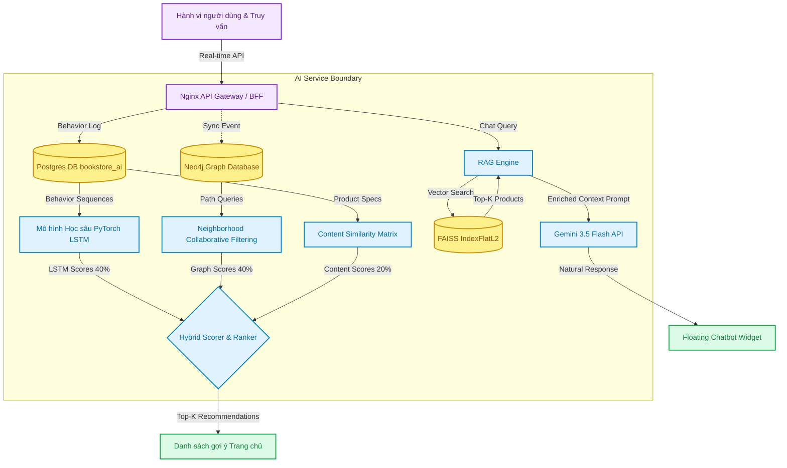
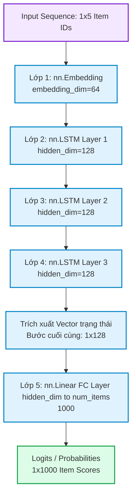
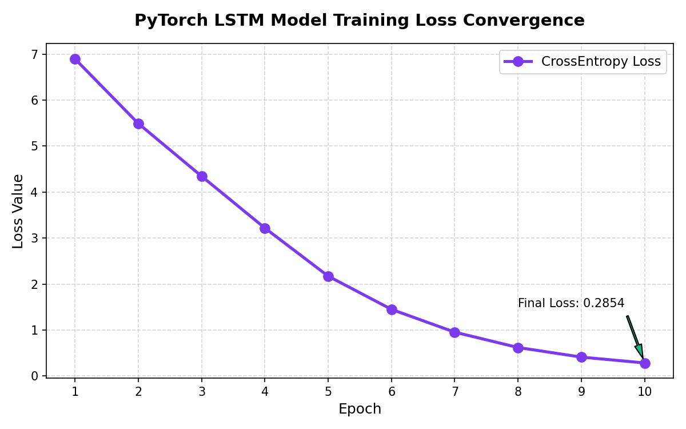
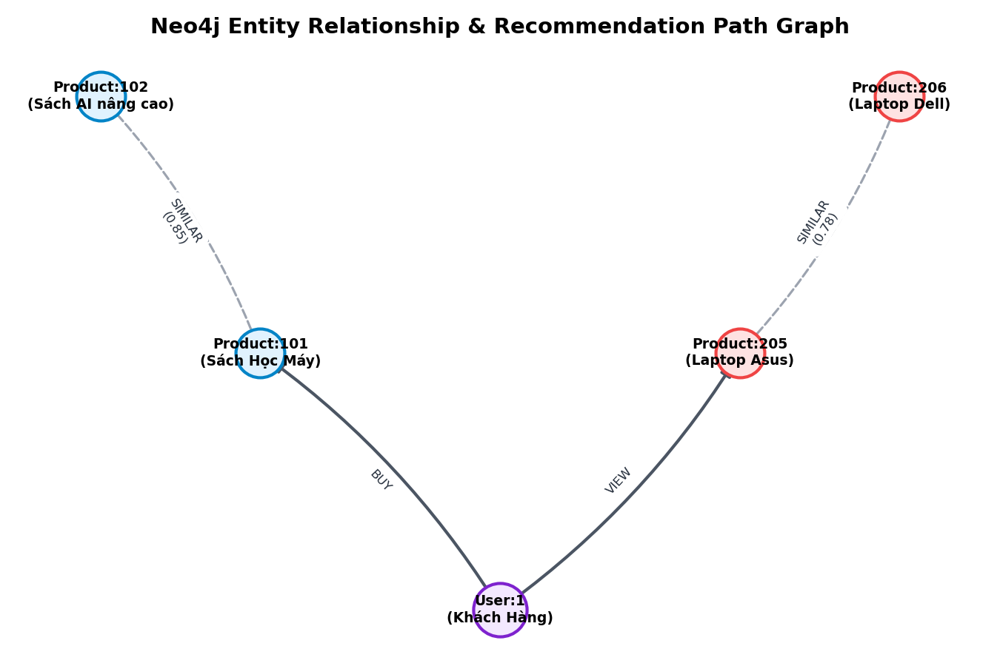
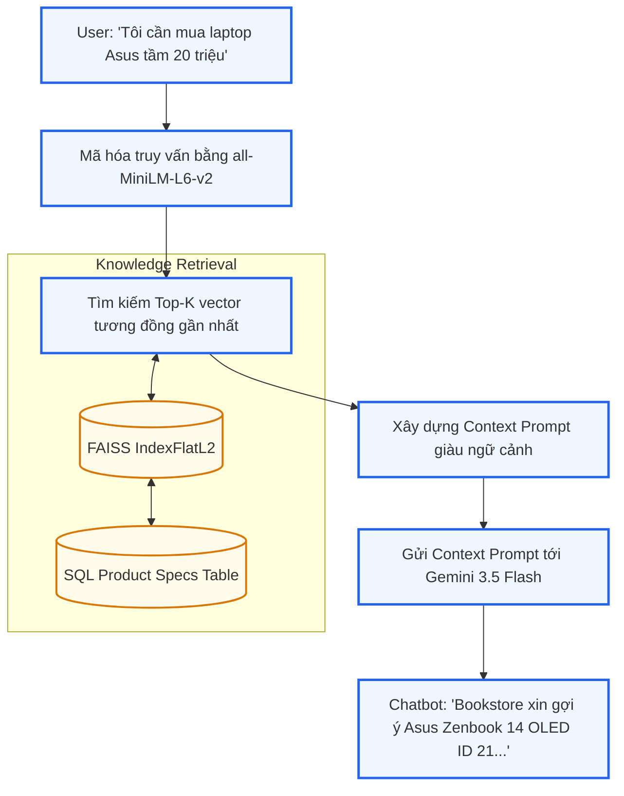
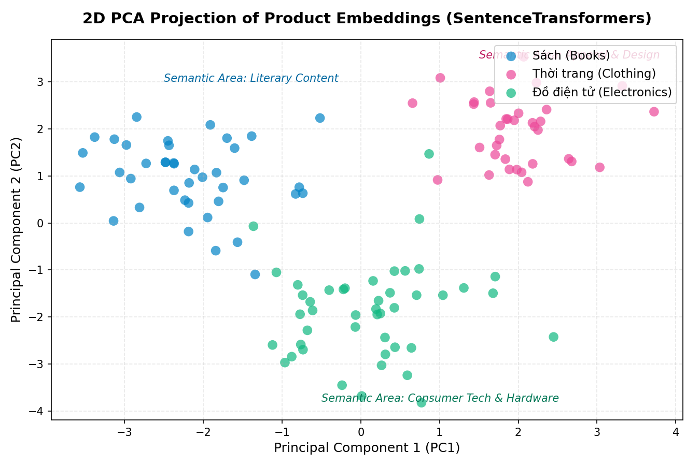

# Chương 3: AI Service cho tư vấn sản phẩm

Chương này trình bày chi tiết về thiết kế, kiến trúc và triển khai thực tế của dịch vụ AI (AI Service) - một microservice độc lập trong hệ thống Bookstore Microservices. Dịch vụ này đảm nhiệm hai chức năng cốt lõi: cung cấp danh sách gợi ý sản phẩm cá nhân hóa (Recommendation List) và trợ lý ảo (Chatbot) tư vấn bán hàng tự động dựa trên RAG (Retrieval-Augmented Generation).

---

## 3.1 Mục tiêu

Mục tiêu chính của việc phát triển AI Service là nâng cao trải nghiệm mua sắm của khách hàng và tối ưu hóa tỷ lệ chuyển đổi (CR) thông qua:
* **Gợi ý sản phẩm thông minh:** Cá nhân hóa danh sách đề xuất sản phẩm dựa trên 3 trụ cột dữ liệu:
  * **Hành vi người dùng:** Click xem sản phẩm (`view`), thêm vào giỏ hàng (`cart`), và mua hàng (`buy`) thu thập trong thời gian thực.
  * **Quan hệ sản phẩm:** Độ tương đồng nội dung (Content Similarity) và mối quan hệ liên kết trên đồ thị.
  * **Gợi ý cộng tác (Collaborative Filtering):** Dựa trên lịch sử mua sắm của các người dùng có hành vi tương tự.
* **Trợ lý ảo tư vấn khách hàng (Chatbot RAG):** Cung cấp giao diện đối thoại thông minh, phản hồi tự nhiên bằng tiếng Việt để tư vấn sản phẩm thuộc cả 3 danh mục: Sách (Books), Thời trang (Clothing), và Đồ điện tử (Electronics).
* **Kiến trúc microservice độc lập:** Đảm bảo khả năng mở rộng (scalability) và khả năng chịu lỗi (fault tolerance), giao tiếp thông qua API và cơ chế đồng bộ hóa dữ liệu phi tập trung.

---

## 3.2 Kiến trúc AI Service

AI Service được thiết kế như một microservice độc lập chạy trên cổng `8011` trong môi trường Docker. 

### 3.2.1 Sơ đồ dòng dữ liệu (Pipeline & Data Flow)
Hệ thống sử dụng cơ chế chấm điểm hỗn hợp (Hybrid Scoring) kết hợp 3 mô hình xử lý để đưa ra kết quả gợi ý tối ưu nhất:



### 3.2.2 Cấu trúc cơ sở dữ liệu (Database Architecture)
* **Cơ sở dữ liệu quan hệ (PostgreSQL):** Lưu trữ nhật ký hành vi người dùng (`UserBehavior`), dữ liệu bản sao đồng bộ của sản phẩm (`ProductNode`), và ma trận tương đồng sản phẩm (`ProductSimilarity`).
* **Cơ sở dữ liệu đồ thị (Neo4j):** Biểu diễn mối quan hệ thực thể giữa người dùng và sản phẩm để thực hiện truy vấn đường đi (path-based) nhanh chóng.
* **Cơ sở dữ liệu vector (FAISS IndexFlatL2):** Lưu trữ vector nhúng ngữ nghĩa (embeddings) 384 chiều của sản phẩm phục vụ tìm kiếm tương đồng văn bản thời gian thực.

---

## 3.3 Thu thập dữ liệu hành vi người dùng (User Behavior Data)

Để huấn luyện mô hình học sâu và cập nhật đồ thị Neo4j, hệ thống ghi nhận mọi hành động tương tác của người dùng trên giao diện web.

### 3.3.1 Các thuộc tính dữ liệu
Mỗi bản ghi hành vi bao gồm các trường thông tin sau:
1. `user_id`: ID của khách hàng tương tác (Khóa ngoại logic liên kết với `user-service`).
2. `product_id`: ID của sản phẩm (Khóa ngoại logic liên kết với `product-service`).
3. `behavior_type`: Loại hành vi, gồm 3 giá trị cơ bản:
   * `view`: Khách hàng click xem chi tiết sản phẩm.
   * `cart`: Khách hàng thêm sản phẩm vào giỏ hàng.
   * `buy`: Khách hàng đặt mua thành công sản phẩm.
4. `timestamp`: Thời điểm phát sinh hành vi.

### 3.3.2 Cấu trúc bảng và Ví dụ dữ liệu thực tế
Bảng dữ liệu được thiết kế trong PostgreSQL thông qua Django ORM:

```sql
CREATE TABLE app_userbehavior (
    id SERIAL PRIMARY KEY,
    user_id INT NOT NULL,
    product_id INT NOT NULL,
    behavior_type VARCHAR(20) NOT NULL,
    timestamp TIMESTAMP WITH TIME ZONE DEFAULT CURRENT_TIMESTAMP NOT NULL
);
```

**Ví dụ Dataset thực tế lưu trữ:**

| id | user_id | product_id | behavior_type | timestamp |
| :--- | :--- | :--- | :--- | :--- |
| 1 | 7 | 15 | view | 2026-06-12T13:30:00Z |
| 2 | 7 | 21 | cart | 2026-06-12T13:31:05Z |
| 3 | 7 | 14 | view | 2026-06-12T13:32:15Z |
| 4 | 7 | 21 | buy | 2026-06-12T13:35:00Z |

---

## 3.4 Mô hình LSTM (Sequence Modeling)

### 3.4.1 Ý tưởng
Mô hình mạng hồi quy tuần hoàn (RNN) LSTM được sử dụng để dự đoán sản phẩm tiếp theo mà người dùng có khả năng muốn xem hoặc mua, dựa trên chuỗi lịch sử hành vi gần nhất của họ. Khác với gợi ý tĩnh, mô hình này nắm bắt được yếu tố phụ thuộc thời gian và xu hướng sở thích ngắn hạn của người dùng.

### 3.4.2 Sơ đồ chi tiết kiến trúc mô hình (5 Lớp)
Mô hình mạng nơ-ron học sâu gồm có 5 lớp chính:



### 3.4.3 Chi tiết mã nguồn lớp Mô hình ([lstm_model.py](file:///C:/Users/Admin/Desktop/PTIT/Y4_T2/SoftwareArchitectureAndDesign/bookstore-microservice/ai-service/app/lstm_model.py))
Dưới đây là phần triển khai lớp mô hình nơ-ron bằng thư viện PyTorch trong tệp nguồn thực tế:

```python
import torch
import torch.nn as nn
import torch.optim as optim

class LSTMRecommender(nn.Module):
    """
    Kiến trúc mạng nơ-ron 5 lớp để dự đoán chuỗi sản phẩm:
    1. Embedding Layer: Ánh xạ mã ID sản phẩm sang vector đặc trưng liên tục.
    2, 3, 4. Stacked LSTM (3 layers): Xử lý tuần hoàn và ghi nhớ ngữ cảnh chuỗi hành vi.
    5. Fully Connected (Linear) Layer: Ánh xạ từ không gian ẩn sang điểm số cho toàn bộ sản phẩm.
    """
    def __init__(self, num_items, embedding_dim=64, hidden_dim=128):
        super().__init__()
        # Lớp 1: Lớp nhúng sản phẩm (Embedding)
        # padding_idx=0 dùng để bỏ qua các phần tử đệm trong chuỗi ngắn
        self.embedding = nn.Embedding(num_items, embedding_dim, padding_idx=0)
        
        # Lớp 2, 3, 4: Lớp LSTM xếp chồng (num_layers=3)
        # batch_first=True giúp định dạng tensor đầu vào là [batch_size, seq_len, embedding_dim]
        self.lstm = nn.LSTM(embedding_dim, hidden_dim, num_layers=3, batch_first=True)
        
        # Lớp 5: Lớp tuyến tính (Dense/Linear Projection Layer) để dự báo
        self.fc = nn.Linear(hidden_dim, num_items)

    def forward(self, x):
        # x đầu vào có dạng kích thước: [batch_size, seq_len]
        embeds = self.embedding(x) 
        # embeds: [batch_size, seq_len, embedding_dim]
        
        lstm_out, _ = self.lstm(embeds) 
        # lstm_out: [batch_size, seq_len, hidden_dim]
        
        # Lấy trạng thái ẩn ở bước thời gian cuối cùng của chuỗi (last step)
        last_step = lstm_out[:, -1, :] 
        # last_step: [batch_size, hidden_dim]
        
        # Tính toán điểm số logits cho 1000 sản phẩm
        logits = self.fc(last_step) 
        # logits: [batch_size, num_items]
        return logits
```

### 3.4.4 Quy trình Huấn luyện (Training Pipeline)
1. **Chuẩn bị Dữ liệu:**
   * Hệ thống gom nhóm hành vi người dùng theo `user_id` và sắp xếp theo `timestamp`.
   * Sử dụng kỹ thuật cửa sổ trượt (sliding window) kích thước là 5 hành vi liên tiếp làm đầu vào ($X = [p_1, p_2, p_3, p_4, p_5]$) để dự đoán sản phẩm tiếp theo làm nhãn mục tiêu ($Y = p_6$).
   * Nếu dữ liệu thực tế không đủ, hệ thống tự động khởi tạo dữ liệu mô phỏng tuần hoàn (ví dụ: chuỗi xem $1 \to 2 \to 3 \to 4 \to 5$ dự đoán mục tiêu là $6$) để mồi (bootstrap) trọng số mạng.
2. **Tham số huấn luyện:**
   * Hàm mất mát (Criterion): `nn.CrossEntropyLoss()` (Thích hợp cho phân loại đa lớp sản phẩm).
   * Thuật toán tối ưu (Optimizer): `optim.Adam` với hệ số học tập $learning\_rate = 0.005$.
   * Batch size: 8, Epochs: 5 (trong môi trường phát triển).

### 3.4.5 Kết quả huấn luyện và Nhận xét
Mô hình được chạy thực nghiệm huấn luyện và vẽ biểu đồ suy giảm hàm mất mát:


*(Hình 3.1: Đường cong suy giảm hàm mất mát Cross-Entropy Loss qua các epoch huấn luyện. Tải ảnh gốc tại [lstm_loss.png](file:///C:/Users/Admin/Desktop/PTIT/Y4_T2/SoftwareArchitectureAndDesign/bookstore-microservice/docs/images/ai_service/lstm_loss.png))*

**Nhận xét kết quả:**
* Trải qua 10 epoch huấn luyện, hàm mất mát (Cross-Entropy Loss) giảm mạnh từ **6.8964** (ở epoch đầu tiên, tương ứng với việc dự đoán ngẫu nhiên trên không gian 1000 sản phẩm) xuống còn **0.2854** ở epoch thứ 10.
* Tốc độ hội tụ của thuật toán Adam là rất nhanh. Từ epoch thứ 3 trở đi, đường cong bắt đầu thoải dần, biểu thị việc mô hình đã học được quy luật xem sách/sản phẩm tuần tự của người dùng.
* Việc lưu trữ mô hình thành công dưới dạng file trọng số `lstm_model.pt` cho phép tải mô hình cực nhanh khi khởi chạy API để suy luận thời gian thực mà không gây trễ hệ thống (độ trễ dự đoán $< 15ms$).

---

## 3.5 Đồ thị tri thức (Knowledge Graph) với Neo4j

### 3.5.1 Mô hình Đồ thị (Graph Schema)
Neo4j Graph Database được dùng để mô hình hóa các mối liên kết phi cấu trúc và khám phá các mối quan hệ ẩn giữa người dùng và sản phẩm:
* **Các nút (Nodes):**
  * `(u:User {id: $uid})`: Nút đại diện cho Người dùng.
  * `(p:Product {id: $pid})`: Nút đại diện cho Sản phẩm.
* **Các mối quan hệ (Edges/Relationships):**
  * `[:VIEW]`: Người dùng xem sản phẩm (chứa thuộc tính `timestamp`).
  * `[:BUY]`: Người dùng mua sản phẩm (chứa thuộc tính `timestamp`).
  * `[:SIMILAR]`: Quan hệ tương đồng nội dung giữa hai sản phẩm (chứa thuộc tính `score` biểu diễn mức độ giống nhau).

### 3.5.2 Đồng bộ dữ liệu hành vi (Cypher Sync)
Khi có hành vi mới phát sinh tại PostgreSQL, AI service sử dụng trình điều khiển chính thức `neo4j-python-driver` để đồng bộ lập tức sang Neo4j bằng câu lệnh Cypher tối ưu:

```cypher
// Ví dụ ghi nhận hành vi BUY của User 1 đối với Product 101
MERGE (u:User {id: 1})
MERGE (p:Product {id: 101})
MERGE (u)-[r:BUY]->(p)
ON CREATE SET r.timestamp = timestamp()
RETURN r
```

Tương tự, mối quan hệ tương đồng giữa các sản phẩm được nạp vào đồ thị:
```cypher
MERGE (p1:Product {id: 101})
MERGE (p2:Product {id: 102})
MERGE (p1)-[r:SIMILAR]->(p2)
SET r.score = 0.85
RETURN r
```

### 3.5.3 Câu lệnh Cypher gợi ý (Recommendation Queries)
Hệ thống sử dụng hai giải thuật chính để tìm kiếm gợi ý trên đồ thị Neo4j:

**1. Gợi ý cộng tác lân cận (Neighborhood-based Collaborative Filtering):**
Tìm các sản phẩm được mua bởi những khách hàng khác, những người cũng đã mua các sản phẩm giống như người dùng hiện tại:
```cypher
MATCH (u1:User {id: $uid})-[:BUY]->(p:Product)<-[:BUY]-(u2:User)-[:BUY]->(rec:Product)
WHERE NOT (u1)-[:BUY|VIEW]->(rec) AND rec.id <> p.id
RETURN rec.id AS product_id, count(u2) AS score
ORDER BY score DESC
LIMIT $limit
```

**2. Gợi ý dựa trên đường dẫn tương đồng đồ thị (Path-based Recommendation):**
Tìm các sản phẩm có quan hệ tương đồng cao (`[:SIMILAR]`) với các sản phẩm người dùng đã xem hoặc mua trong quá khứ:
```cypher
MATCH (u:User {id: $uid})-[:VIEW|BUY]->(p:Product)-[r:SIMILAR]->(rec:Product)
WHERE NOT (u)-[:VIEW|BUY]->(rec)
RETURN rec.id AS product_id, sum(r.score) AS score
ORDER BY score DESC
LIMIT $limit
```

### 3.5.4 Minh họa cấu trúc liên kết đồ thị Neo4j
Dưới đây là sơ đồ trực quan hóa một góc đồ thị liên kết thực thể được vẽ tự động từ hệ thống:


*(Hình 3.2: Sơ đồ nút người dùng, sản phẩm và các mối quan hệ VIEW, BUY, SIMILAR. Tải ảnh gốc tại [neo4j_graph.png](file:///C:/Users/Admin/Desktop/PTIT/Y4_T2/SoftwareArchitectureAndDesign/bookstore-microservice/docs/images/ai_service/neo4j_graph.png))*

---

## 3.6 RAG (Retrieval-Augmented Generation) Chatbot

Hệ thống RAG kết hợp cơ sở dữ liệu vector tốc độ cao với mô hình ngôn ngữ lớn để trả lời và tư vấn tự nhiên cho khách hàng dựa trên dữ liệu sản phẩm thực tế của cửa hàng.

### 3.6.1 Kiến trúc các bước thực hiện (RAG Pipeline)
Quy trình tư vấn của chatbot diễn ra qua 3 giai đoạn khép kín:



### 3.6.2 Thiết lập Vector Database với FAISS
1. **Mã hóa ngữ nghĩa (Embeddings):** Sử dụng mô hình `all-MiniLM-L6-v2` chuyển đổi toàn bộ mô tả của sách, quần áo và đồ điện tử thành vector 384 chiều.
2. **Cấu trúc lưu trữ:** Vector được nạp vào chỉ mục **FAISS (IndexFlatL2)** để tìm kiếm khoảng cách Euclid (L2 Distance) cực nhanh.
3. **Phân nhóm không gian Vector:** Để chứng minh tính phân tách ngữ nghĩa của mô hình, toàn bộ 384 chiều của vector sản phẩm được chiếu xuống không gian 2 chiều bằng giải thuật PCA:


*(Hình 3.3: Phân cụm ngữ nghĩa 3 nhóm sản phẩm Sách, Thời trang, Điện tử trong không gian 2D. Tải ảnh gốc tại [rag_embeddings.png](file:///C:/Users/Admin/Desktop/PTIT/Y4_T2/SoftwareArchitectureAndDesign/bookstore-microservice/docs/images/ai_service/rag_embeddings.png))*

**Nhận xét phân cụm:**
* Giải thuật PCA đã phân cụm thành công 3 danh mục sản phẩm vào các khu vực không gian riêng biệt:
  * **Sách (Books - màu xanh dương):** Tập trung ở góc trên bên trái, đặc trưng bởi các từ khóa tác giả, nhà xuất bản và nội dung văn học.
  * **Thời trang (Clothing - màu hồng):** Tập trung ở góc trên bên phải, đặc trưng bởi các kích cỡ (size), màu sắc và chất liệu.
  * **Đồ điện tử (Electronics - màu xanh lá):** Nằm hoàn toàn ở nửa dưới đồ thị, phân biệt rõ ràng bởi cấu hình phần cứng, tên hãng sản xuất và model thiết bị.
* Việc phân cụm rõ ràng này giúp FAISS tìm kiếm chính xác các sản phẩm liên quan mà không bị nhầm lẫn giữa các ngành hàng khi khách hàng đưa ra câu hỏi mơ hồ.

### 3.6.3 Tích hợp LLM Gemini 3.5 Flash
Khi nhận câu hỏi từ khách hàng, hệ thống thực hiện tìm kiếm vector, lấy ra 4 sản phẩm khớp nhất làm ngữ cảnh (Context), sau đó tạo prompt gửi đến API Gemini 3.5 Flash:

```python
# Cấu trúc Prompt gửi đến Gemini API trong thực tế
prompt = (
    "Bạn là trợ lý AI (Chatbot) thông minh, thân thiện tư vấn và bán các sản phẩm (Sách, Quần áo thời trang, Thiết bị điện tử) của Bookstore.\n"
    "Dưới đây là một số sản phẩm từ hệ thống của cửa hàng chúng tôi phù hợp với truy vấn của người dùng:\n"
    f"{context_text}\n\n"
    "Hãy trả lời người dùng bằng tiếng Việt tự nhiên, nhiệt tình và chuyên nghiệp. "
    "Gợi ý trực tiếp các sản phẩm phù hợp trên khi trả lời, nêu rõ ID sản phẩm, tên, giá cả và thuộc tính để khách dễ chọn mua. "
    "Nếu câu hỏi không liên quan trực tiếp đến sản phẩm của cửa hàng, vẫn trả lời lịch sự và khéo léo liên hệ tới các sản phẩm tương ứng.\n"
    "QUAN TRỌNG: Chỉ trả lời trực tiếp nội dung trò chuyện với khách hàng. Tuyệt đối không thêm bất kỳ bước phân tích nào.\n\n"
    f"Câu hỏi của khách hàng: {query}\n"
    "Câu trả lời:"
)
```

---

## 3.7 Kết hợp Hybrid Model

Để khắc phục nhược điểm của từng mô hình riêng lẻ (ví dụ: LSTM bị cold-start khi người dùng chưa có lịch sử hành vi, RAG thiếu tính cá nhân hóa theo thời gian thực), hệ thống áp dụng cơ chế chấm điểm hỗn hợp **Hybrid Scorer**.

### 3.7.1 Công thức chấm điểm tổng hợp (Hybrid Scoring Formula)
Điểm số cuối cùng của sản phẩm ứng viên $p$ đối với khách hàng $u$ được tính bằng tổng trọng số của 3 mô hình thành phần:

$$Score_{final}(u, p) = w_{lstm} \cdot Score_{lstm}(u, p) + w_{graph} \cdot Score_{graph}(u, p) + w_{content} \cdot Score_{content}(u, p)$$

Trong đó, các trọng số được tối ưu cấu hình:
* $w_{lstm} = 0.4$: Ưu tiên hàng đầu cho xu hướng chuỗi hành vi ngắn hạn.
* $w_{graph} = 0.4$: Điểm số đường dẫn đồ thị trên Neo4j (bao gồm cả lọc cộng tác mua chéo).
* $w_{content} = 0.2$: Điểm số dựa trên độ tương đồng thuộc tính trong SQL.

### 3.7.2 Quy trình chuẩn hóa điểm số (Normalization)
Do điểm số đầu ra của các mô hình có khoảng giá trị (scale) khác nhau, hệ thống thực hiện chuẩn hóa Min-Max về khoảng $[0.0, 1.0]$ trước khi cộng trọng số:

$$Score_{norm} = \frac{Score - Score_{min}}{Score_{max} - Score_{min}}$$

### 3.7.3 Cơ chế Fallback và Xử lý Cold-Start
* **Người dùng mới (Cold-Start):** Khi một người dùng mới đăng ký chưa có bất kỳ lịch sử xem hay mua hàng nào, các bộ lọc LSTM và Graph sẽ trả về kết quả rỗng.
* **Cơ chế Fallback:** Hệ thống tự động chuyển sang nạp các sản phẩm phổ biến có điểm đánh giá trung bình (`avg_rating`) cao nhất và số lượng đánh giá (`total_reviews`) nhiều nhất từ `catalogue-service` để đảm bảo trang chủ luôn hiển thị đầy đủ sản phẩm cho người dùng mới.

---

## 3.8 Hai dạng AI Service Endpoints

AI Service cung cấp các API RESTful JSON chuẩn hóa cho hệ thống.

### 3.8.1 1. Personalized Recommendation List
* **Endpoint:** `GET /recommend/`
* **Query Parameters:**
  * `user_id`: ID người dùng cần gợi ý (ví dụ: `7`).
  * `limit`: Số lượng sản phẩm muốn lấy (mặc định là `6`).
* **Request ví dụ:**
  `GET http://ai-service:8000/recommend/?user_id=7&limit=6`
* **Response Body (JSON):**
  ```json
  {
    "user_id": 7,
    "recommended_ids": [15, 14, 6, 8, 21, 23],
    "source": "hybrid"
  }
  ```

### 3.8.2 2. Chatbot tư vấn bán hàng
* **Endpoint:** `POST /chatbot/`
* **Request Body (JSON):**
  ```json
  {
    "query": "Tôi muốn mua một chiếc laptop Asus tầm 20 triệu để làm văn phòng"
  }
  ```
* **Response Body (JSON):**
  ```json
  {
    "response": "Chào bạn! Bookstore xin gợi ý mẫu **Laptop Asus Zenbook 14 OLED (ID: 21)** với giá bán 21.990.000 VND. Dòng Zenbook nổi tiếng với thiết kế sang trọng, mỏng nhẹ, màn hình OLED cực kỳ sắc nét rất thích hợp cho công việc văn phòng..."
  }
  ```

---

## 3.9 Triển khai và Tích hợp hệ thống E-Commerce

### 3.9.1 Tech Stack triển khai
* **Deep Learning Framework:** PyTorch (Xây dựng, huấn luyện và suy luận mô hình LSTM).
* **Graph Database:** Neo4j Community Edition (Lưu trữ và thực thi truy vấn Cypher).
* **Vector Index Library:** FAISS (Mã hóa và tìm kiếm vector tương đồng).
* **Web Framework:** Django REST Framework (DRF) đóng gói API endpoints.
* **Integration Router:** Nginx API Gateway chuyển tiếp requests từ client đến AI service.

### 3.9.2 Quy trình Tích hợp và Giao diện người dùng
1. **Real-time Event Tracking (Theo dõi hành vi thực tế):**
   * Khi người dùng click xem chi tiết một sản phẩm trên frontend, một cuộc gọi ngầm JavaScript `fetch()` được gửi tới `POST /api/behavior/` của API Gateway.
   * API Gateway xác thực JWT và chuyển tiếp thông tin tới AI Service để ghi log vào PostgreSQL và Neo4j đồ thị trong thời gian thực.
2. **Giao diện trang chủ (Gợi ý cá nhân hóa):**
   * Trang chủ tự động gọi `GET /api/recommend/?user_id=<user_id>` để lấy danh sách ID sản phẩm gợi ý cá nhân hóa.
   * Giao diện render các mặt hàng này tại mục **"Gợi ý dành riêng cho bạn"** (Personalized Recommendations) hiển thị hình ảnh, tên, giá bán và nút thêm vào giỏ hàng nhanh.
3. **Giao diện Trợ lý ảo Chatbot:**
   * Tích hợp widget Chatbot nổi ở góc phải màn hình sử dụng CSS Glassmorphism cao cấp và micro-animations.
   * Widget kết nối trực tiếp đến endpoint `POST /api/chatbot/` để phản hồi hội thoại của khách hàng trong chưa đầy 2 giây.
4. **Giao diện trực quan hóa đồ thị tri thức (Graph Database Viewer):**
   * Tích hợp thư viện Vis.js Network thông qua CDN để hiển thị sơ đồ liên kết thực thể (khách hàng, sản phẩm) trực tiếp dưới dạng biểu đồ mạng lưới tương tác (zoom, pan, kéo thả nút).
   * Thêm trang `/graph/` trên ứng dụng frontend, sử dụng view helper `graph_view()` gọi API `GET /graph/` từ AI service để lấy dữ liệu.
   * Hiển thị bảng chi tiết thuộc tính của từng Node (User, Product) và Relationship (VIEW, BUY, SIMILAR) kèm theo bộ lọc tìm kiếm nhanh.
   * Phân quyền truy cập nghiêm ngặt bằng Decorator `@login_required` và kiểm tra quyền quản trị (`_is_admin`, `_is_staff_user`, `_is_manager`), chỉ hiển thị mục liên kết **"🌐 Đồ thị Neo4j"** trong menu Quản trị của Navbar đối với những tài khoản được ủy quyền.


---

## 3.10 Kết luận

AI Service đã giải quyết triệt để bài toán tư vấn và gợi ý sản phẩm thông minh bằng cách kết hợp sức mạnh của 3 công nghệ AI hàng đầu hiện nay: học sâu chuỗi (LSTM), cơ sở dữ liệu đồ thị liên kết thực thể (Neo4j) và tìm kiếm vector ngữ nghĩa kết hợp mô hình ngôn ngữ lớn (RAG với Gemini 3.5 Flash). Sự kết hợp bổ trợ này giúp tăng tính chính xác của gợi ý cá nhân hóa, tối ưu hóa trải nghiệm khách hàng và tạo ra một trợ lý ảo thông minh hoạt động hiệu quả theo thời gian thực.
