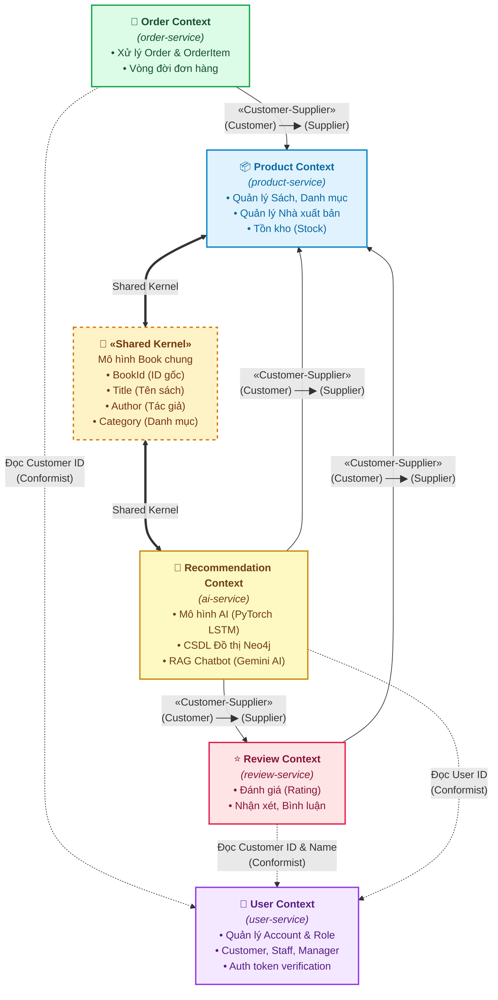

# Sơ đồ và Phân tích Strategic DDD Context Map - Bookstore Microservices

Tài liệu này cung cấp sơ đồ **Context Map** chi tiết theo nguyên lý **Domain-Driven Design (DDD)** cho hệ thống bán sách trực tuyến của bạn, thể hiện mối quan hệ nghiệp vụ, sự phụ thuộc và cơ chế chia sẻ mô hình dữ liệu giữa các **Bounded Context**.

---

## 1. Bản đồ ngữ cảnh (DDD Context Map Diagram)

Dưới đây là sơ đồ Context Map của hệ thống được trực quan hóa bằng Mermaid. Mối quan hệ **Customer-Supplier** được thể hiện qua hướng mũi tên từ **Customer** (Bên tiêu thụ) chỉ đến **Supplier** (Bên cung cấp), đi kèm nhãn ghi rõ vai trò. Vùng **Shared Kernel** biểu thị phần dữ liệu dùng chung giữa Product Context và Recommendation Context.

---

## 2. Chi tiết các Bounded Context

### 2.1 User Context (quản lý người dùng, xác thực)
* **Dịch vụ chịu trách nhiệm:** `user-service`
* **Cơ sở dữ liệu:** MySQL (`bookstore_user`)
* **Aggregate Root:** `Customer`, `Staff`, `Manager`
* **Nhiệm vụ chính:** Quản lý vòng đời tài khoản người dùng, phân quyền (Khách hàng, Nhân viên, Quản trị viên). Nơi cung cấp token xác thực JWT cho hệ thống thông qua Nginx Gateway.

### 2.2 Product Context (quản lý sách, danh mục, tồn kho)
* **Dịch vụ chịu trách nhiệm:** `product-service`
* **Cơ sở dữ liệu:** PostgreSQL (`bookstore_product`)
* **Aggregate Root:** `Product`
* **Entities liên đới:** `Category`, `Publisher`
* **Nhiệm vụ chính:** Quản lý thông tin sách, thuộc tính sản phẩm linh hoạt (qua JSON attributes), quản lý tồn kho hiện hữu, nhà xuất bản và danh mục.

### 2.3 Review Context (quản lý đánh giá sách)
* **Dịch vụ chịu trách nhiệm:** `review-service`
* **Cơ sở dữ liệu:** PostgreSQL (`bookstore_review`)
* **Aggregate Root:** `Review`
* **Nhiệm vụ chính:** Cho phép người dùng viết đánh giá, chấm điểm (rating 1-5) cho các đầu sách và tổng hợp điểm trung bình.

### 2.4 Order Context (quản lý đơn hàng)
* **Dịch vụ chịu trách nhiệm:** `order-service`
* **Cơ sở dữ liệu:** PostgreSQL (`bookstore_order`)
* **Aggregate Root:** `Order`
* **Entities liên đới:** `OrderItem`
* **Nhiệm vụ chính:** Đóng gói thông tin đặt hàng, lưu trữ giá sách tại thời điểm đặt (price_at_order), tính tổng tiền và cập nhật vòng đời đơn hàng (`pending`, `confirmed`, `shipping`, `delivered`, `cancelled`).

### 2.5 Recommendation Context (gợi ý sách bằng AI và Neo4j)
* **Dịch vụ chịu trách nhiệm:** `ai-service`
* **Cơ sở dữ liệu:** PostgreSQL (`bookstore_ai`) & Neo4j (CSDL đồ thị) & Vector Index (FAISS)
* **Entities liên đới:** `ProductNode`, `ProductSimilarity`, `UserBehavior`
* **Nhiệm vụ chính:** Tạo các liên kết đồ thị biểu diễn độ tương đồng sách và chuỗi hành vi người dùng (Xem, Mua), huấn luyện mô hình LSTM gợi ý sản phẩm, và triển khai RAG Chatbot hỗ trợ tư vấn trực tuyến dựa trên API Gemini AI.

---

## 3. Phân tích các mối quan hệ trên Context Map

### 3.1 Quan hệ Customer-Supplier (Khách hàng - Nhà cung cấp)
Trong quan hệ này, **Supplier** nằm ở thượng nguồn (Upstream), khi có thay đổi về thiết kế API hoặc cấu trúc dữ liệu của Supplier, phía **Customer** ở hạ nguồn (Downstream) sẽ chịu ảnh hưởng và phải điều chỉnh tương ứng.

* **Review Context (Customer) ──▶ Product Context (Supplier):**
  * **Lý do:** Khi một review được tạo, nó bắt buộc phải liên kết với một sản phẩm tồn tại thực tế trong Product Context. Review Context cần biết thông tin cơ bản của sản phẩm (`product_id`, `book_title`) để xác thực tính hợp lệ của đánh giá.
  * **Cách thức hoạt động:** Khi người dùng submit review, hệ thống kiểm tra sự tồn tại của sản phẩm thông qua Product API trước khi lưu xuống Database của Review.
* **Order Context (Customer) ──▶ Product Context (Supplier):**
  * **Lý do:** Đơn hàng được tạo thành từ các món hàng chọn mua. Order Context phụ thuộc vào Product Context để lấy thông tin sản phẩm và quan trọng nhất là **giá bán hiện tại** cùng trạng thái **tồn kho (stock)** để đảm bảo sách còn hàng tại thời điểm đặt.
  * **Cách thức hoạt động:** BFF thực hiện truy vấn thông tin sách từ Product Context rồi gửi payload hoàn chỉnh xuống Order Context để tạo bản ghi `OrderItem` với mức giá được chốt chặn (`price_at_order`).
* **Recommendation Context (Customer) ──▶ Product Context & Review Context (Suppliers):**
  * **Lý do:** Mô hình gợi ý AI cần dữ liệu đầu vào phong phú từ Product Context (danh mục, tên tác giả để tính độ tương đồng) và Review Context (lịch sử đánh giá của người dùng để phân tích sở thích và hành vi).
  * **Cách thức hoạt động:** `ai-service` định kỳ hoặc trong quá trình bootstrap sẽ tạo các luồng kéo dữ liệu (sync) đồng bộ qua REST API từ Catalogue/Product và Review để nạp vào CSDL Neo4j của mình.

### 3.2 Quan hệ Shared Kernel (Nhân chung / Lõi dùng chung)
* **Product Context 🤝 Recommendation Context:**
  * **Đặc điểm:** Hai ngữ cảnh này chia sẻ chung mô hình dữ liệu lõi đại diện cho cuốn sách (**Book Model**). Mô hình dùng chung này bao gồm các trường thông tin tối giản: `BookId`, `Title`, `Author`, và `Category`.
  * **Lý do:** Product Context cần những thông tin này để hiển thị catalogue và quản lý nghiệp vụ bán hàng. Recommendation Context cần chính xác các thông tin này để huấn luyện mô hình học máy (LSTM), xây dựng chỉ mục vector phục vụ RAG Chatbot, và thiết lập các mối quan hệ tương đồng (`SIMILAR`) trên đồ thị Neo4j.
  * **Ràng buộc:** Mọi thay đổi cấu trúc của 4 trường thuộc Shared Kernel này đều yêu cầu sự thống nhất và đồng thuận từ cả 2 nhóm phát triển của 2 dịch vụ, nhằm tránh lỗi crash hệ thống đề xuất hoặc sai lệch liên kết dữ liệu đồ thị.

---

## 4. Thiết kế kỹ thuật hỗ trợ Context Map trong Code

| Mối quan hệ                                   | Kênh giao tiếp trong hệ thống           | Chi tiết cài đặt trong Codebase                                                                                                                                        |
| :----------------------------------------------| :----------------------------------------| :-----------------------------------------------------------------------------------------------------------------------------------------------------------------------|
| **Review ──▶ Product** (C-S)                  | HTTP REST API (Đồng bộ)                 | BFF gọi GET `/products/<id>/` để xác thực sách trước khi gửi dữ liệu đánh giá tới review-service.                                                                      |
| **Order ──▶ Product** (C-S)                   | HTTP REST API (Đồng bộ)                 | BFF (`api-gateway/api_gateway/views.py#L224-L265`) lấy thông tin sách từ `product-service` để tính giá tổng (`price * quantity`) trước khi gọi `/orders/create/`.      |
| **Recommendation ──▶ Product & Review** (C-S) | HTTP REST API & Background Sync         | Tập tin `ai-service/app/sync_helper.py#L29-L45` gọi HTTP GET đến `product-service` để đồng bộ thực thể, và gọi `review-service` để đồng bộ hành vi (`L118-L127`).      |
| **Shared Kernel**                             | Database-per-service + Local Node Sync  | Mô hình `ProductNode` tại `ai-service/app/models.py` được thiết kế tương thích hoàn toàn với schema của `product-service` để lưu trữ bản sao dữ liệu phục vụ xử lý AI. |
| **User Dependency**                           | Centralized Auth & HTTP Headers mapping | Nginx Gateway verify JWT token tại `user-service` và trích xuất `X-User-Id` để inject vào request đi xuống các service.                                                |
