# Chương 2: Phát triển Hệ E-Commerce Microservices - Bookstore System

Tài liệu này là báo cáo thiết kế và phát triển chi tiết cho hệ thống E-Commerce Microservices của bạn, bám sát cấu trúc mã nguồn thực tế tại [bookstore-microservice](file:///C:/Users/Admin/Desktop/PTIT/Y4_T2/SoftwareArchitectureAndDesign/bookstore-microservice).

---

## 2.1 Xác định yêu cầu

### 2.1.1 Functional Requirements (Yêu cầu chức năng)
* **Quản lý sản phẩm đa miền (product-service):** Hỗ trợ lưu trữ, phân loại và quản lý các loại sản phẩm khác nhau (Sách - Book, Thời trang - Clothing, Đồ điện tử - Electronic).
* **Quản lý người dùng và phân quyền (user-service):** Phân chia vai trò người dùng rõ ràng (Khách hàng - Customer, Nhân viên - Staff, Quản lý - Manager) và hỗ trợ xác thực tập trung bằng token JWT.
* **Giỏ hàng (cart-service):** Cho phép người dùng thêm sản phẩm vào giỏ hàng, cập nhật số lượng, xem giỏ hàng và xóa giỏ hàng.
* **Đơn hàng (order-service):** Xử lý quy trình đặt hàng từ giỏ hàng, chốt giá tại thời điểm mua, quản lý trạng thái đơn hàng.
* **Thanh toán (payment-service):** Xử lý thanh toán đa phương thức (COD, Chuyển khoản, Thẻ, Ví điện tử) và theo dõi trạng thái giao dịch.
* **Giao hàng (shipping-service):** Quản lý quá trình vận chuyển, cập nhật mã vận đơn (tracking_number), đơn vị vận chuyển và trạng thái giao hàng.
* **Gợi ý và Tìm kiếm thông minh (ai-service & catalogue-service):** Tổng hợp danh mục sản phẩm kèm điểm đánh giá; áp dụng AI gợi ý sản phẩm và RAG Chatbot tư vấn khách hàng.

### 2.1.2 Non-functional Requirements (Yêu cầu phi chức năng)
* **Scalability (Khả năng mở rộng):** Các microservices chạy trên các container độc lập và sử dụng các cơ sở dữ liệu riêng, cho phép scale-out độc lập (ví dụ: nhân bản `product-service` khi lượng xem tăng cao).
* **High Availability (Tính sẵn sàng cao):** Hệ thống có cơ chế tự phục hồi và chịu lỗi (Circuit Breaker, Timeout, Retry) triển khai tại tầng BFF API Gateway để ngăn chặn lỗi dây chuyền.
* **Security (Bảo mật):** Xác thực JWT tập trung tại Nginx Reverse Proxy qua `auth_request` của module Nginx, giúp làm sạch và chống giả mạo các Header danh tính (`X-User-*`).
* **Maintainability (Khả năng bảo trì):** Tách biệt nghiệp vụ rõ ràng theo Bounded Context, giúp các đội ngũ phát triển có thể nâng cấp từng service mà không làm ảnh hưởng đến các service khác.

### 2.1.3 Sơ đồ Use Case tổng quan (Use Case Diagram)

Dưới đây là sơ đồ Use Case của toàn bộ hệ thống bán sách trực tuyến, mô tả sự tương tác của 3 Actor chính: Khách hàng (Customer), Nhân viên (Staff), và Quản lý (Manager) với các phân hệ chức năng:

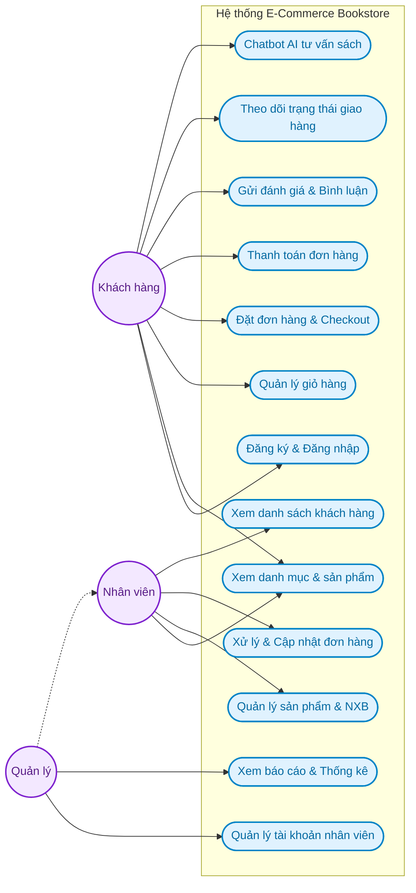

---

## 2.2 Phân rã hệ thống theo DDD

### 2.2.1 Bounded Context
Hệ thống được chia thành các Bounded Context tương ứng với các dịch vụ cụ thể:
* **User Context** (`user-service`) ── CSDL: MySQL (`bookstore_user`)
* **Product Context** (`product-service`) ── CSDL: PostgreSQL (`bookstore_product`)
* **Cart Context** (`cart-service`) ── CSDL: PostgreSQL (`bookstore_cart`)
* **Order Context** (`order-service`) ── CSDL: PostgreSQL (`bookstore_order`)
* **Payment Context** (`payment-service`) ── CSDL: PostgreSQL (`bookstore_payment`)
* **Shipping Context** (`shipping-service`) ── CSDL: PostgreSQL (`bookstore_shipping`)
* **Notification Context** (`notification-service`) ── CSDL: PostgreSQL (`bookstore_notification`)
* **AI Recommendation Context** (`ai-service`) ── CSDL: PostgreSQL (`bookstore_ai`) & Neo4j

### 2.2.2 Nguyên tắc thiết kế
* **Database-per-Service:** Mỗi service sở hữu cơ sở dữ liệu riêng. Không được thực hiện các câu truy vấn JOIN trực tiếp xuyên cơ sở dữ liệu.
* **Giao tiếp hỗn hợp:** Kết hợp giao tiếp đồng bộ qua **REST HTTP API** cho các tác vụ thời gian thực (đọc dữ liệu) và giao tiếp bất đồng bộ qua **Redis Pub/Sub Event Broker** cho các luồng xử lý trạng thái liên kết dịch vụ.

---

## 2.3 Thiết kế Product Service (Django)

### 2.3.1 Phân loại sản phẩm
Hệ thống sử dụng cơ chế **Multi-table Inheritance thông qua quan hệ OneToOne** để quản lý các danh mục sản phẩm chuyên biệt, tách biệt thuộc tính của từng miền dữ liệu:
* **Sách (Book):** Liên kết 1-1 với Product, chứa các thuộc tính: tác giả (`author`), nhà xuất bản (`publisher`), mã `isbn`.
* **Điện tử (Electronics):** Liên kết 1-1 với Product, chứa các thuộc tính: thương hiệu (`brand`), thời hạn bảo hành (`warranty`).
* **Thời trang (Fashion):** Liên kết 1-1 với Product, chứa các thuộc tính: kích cỡ (`size`), màu sắc (`color`).

### 2.3.2 Mã nguồn Model (`product-service/app/models.py`)
```python
from django.db import models

class Publisher(models.Model):
    name    = models.CharField(max_length=255)
    address = models.TextField(blank=True, default='')
    mail    = models.EmailField(unique=True)

class Category(models.Model):
    name          = models.CharField(max_length=255)
    description   = models.TextField(blank=True, default='')
    category_type = models.CharField(max_length=50, default='clothing') # clothing / electronic

class Product(models.Model):
    PRODUCT_TYPES = [
        ('book', 'Sách'),
        ('clothing', 'Thời trang'),
        ('electronic', 'Điện tử'),
    ]
    name         = models.CharField(max_length=255)
    product_type = models.CharField(max_length=50, choices=PRODUCT_TYPES)
    price        = models.DecimalField(max_digits=12, decimal_places=2)
    stock        = models.IntegerField()
```

### 2.3.3 Chi tiết theo domain (Domain Specifications)

Để bám sát theo nghiệp vụ chi tiết của từng loại sản phẩm, cấu trúc logic của các lớp được đặc tả cụ thể như sau:

**Book (Sách):**
```python
class Book(models.Model):
    product   = models.OneToOneField(Product, on_delete=models.CASCADE)
    author    = models.CharField(max_length=255)
    publisher = models.CharField(max_length=255)
    isbn      = models.CharField(max_length=20)
```

**Electronics (Đồ điện tử):**
```python
class Electronics(models.Model):
    product  = models.OneToOneField(Product, on_delete=models.CASCADE)
    brand    = models.CharField(max_length=100)
    warranty = models.IntegerField()
```

**Fashion (Thời trang):**
```python
class Fashion(models.Model):
    product = models.OneToOneField(Product, on_delete=models.CASCADE)
    size    = models.CharField(max_length=10)
    color   = models.CharField(max_length=50)
```

### 2.3.4 Logic nghiệp vụ
1. **Quản lý đa dạng sản phẩm (OneToOne):** Khi tạo một sản phẩm mới, `product-service` lưu thông tin chung vào bảng `Product`. Dựa vào trường `product_type`, hệ thống sẽ khởi tạo bản ghi chi tiết tương ứng ở các bảng `Book`, `Electronics`, hoặc `Fashion`. Tiến trình này được thực hiện trong một Database Transaction nhằm bảo đảm tính nhất quán dữ liệu.
2. **Kiểm tra và cập nhật kho hàng (Stock Allocation):** Dịch vụ cung cấp logic kiểm tra tồn kho cho BFF API Gateway khi xử lý checkout. Khi đơn hàng được thanh toán thành công, số lượng tồn kho (`stock`) sẽ được giảm tương ứng.
3. **Phân loại sản phẩm:** Cho phép liên kết logic sản phẩm với các danh mục chuyên biệt (`Category`) và nhà xuất bản (`Publisher`).

### 2.3.5 API của Product Service
* `GET /products/` ─ Lấy danh sách sản phẩm (hỗ trợ tìm kiếm, phân trang và lọc theo `product_type`, `category`).
* `POST /products/` ─ Thêm mới sản phẩm (gồm dữ liệu `Product` chung và thông tin domain con `Book`/`Electronics`/`Fashion`).
* `GET /products/{id}/` ─ Lấy chi tiết sản phẩm (tự động đi kèm thông tin domain con).
* `PUT/PATCH /products/{id}/` ─ Cập nhật thông tin sản phẩm và thông tin domain con (Manager/Staff).
* `DELETE /products/{id}/` ─ Xóa sản phẩm khỏi hệ thống (Manager/Staff).
* `GET /publishers/` ─ Lấy danh sách nhà xuất bản.
* `POST /publishers/` ─ Tạo mới nhà xuất bản (Manager/Staff).
* `PUT/PATCH /publishers/{id}/` ─ Chỉnh sửa thông tin nhà xuất bản (Manager/Staff).
* `DELETE /publishers/{id}/` ─ Xóa nhà xuất bản (Manager/Staff).
* `GET /categories/` ─ Lấy danh sách danh mục phân loại sản phẩm.
* `POST /categories/` ─ Tạo mới danh mục sản phẩm (Manager/Staff).
* `PUT/PATCH /categories/{id}/` ─ Chỉnh sửa thông tin danh mục (Manager/Staff).
* `DELETE /categories/{id}/` ─ Xóa danh mục sản phẩm (Manager/Staff).

### 2.3.6 Sơ đồ lớp phân tích (Analytical Class Diagram)
Dưới đây là sơ đồ lớp phân tích mô tả mối tương quan giữa tầng Model, tầng Serializer (chuyển đổi dữ liệu) và ViewSet (xử lý API nghiệp vụ) trong `product-service`:

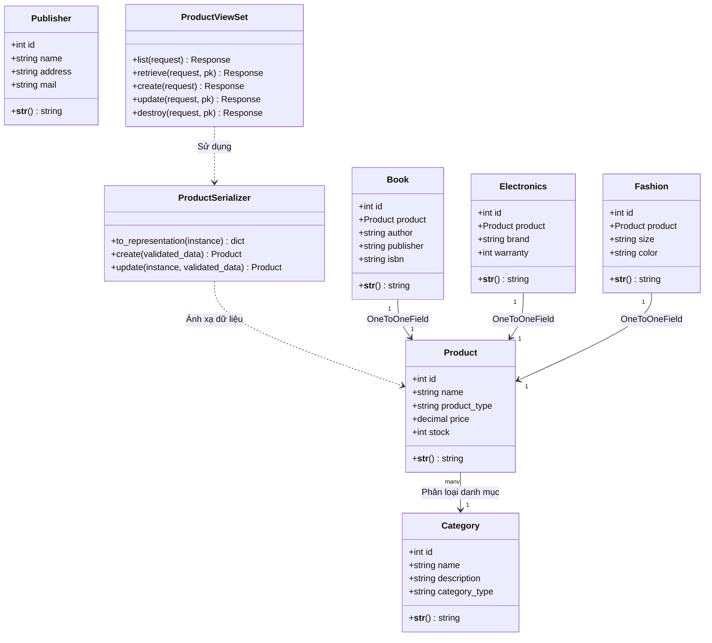

---

## 2.4 Thiết kế User Service (Django)

### 2.4.1 Phân loại người dùng
Dịch vụ phân tách tài khoản người dùng thành 3 vai trò được liên kết 1-1 với tài khoản User hệ thống:
* **Admin (Superuser):** Toàn quyền quản trị hệ thống.
* **Staff (Nhân viên):** Có quyền vận hành hệ thống, xử lý đơn hàng, kho bãi và giao hàng.
* **Customer (Khách hàng):** Người mua hàng, gửi đánh giá sản phẩm.

### 2.4.2 Mã nguồn Model (`user-service/app/models.py`)
```python
from django.db import models
from django.contrib.auth.models import User

class Customer(models.Model):
    user  = models.OneToOneField(User, on_delete=models.CASCADE, null=True, related_name='customer_profile')
    name  = models.CharField(max_length=255)
    email = models.EmailField(unique=True)

class Staff(models.Model):
    user       = models.OneToOneField(User, on_delete=models.CASCADE, null=True, related_name='staff_profile')
    name       = models.CharField(max_length=255)
    email      = models.EmailField(unique=True)
    active     = models.BooleanField(default=True)
    created_at = models.DateTimeField(auto_now_add=True)

class Manager(models.Model):
    user       = models.OneToOneField(User, on_delete=models.CASCADE, null=True, related_name='manager_profile')
    name       = models.CharField(max_length=255)
    email      = models.EmailField(unique=True)
    active     = models.BooleanField(default=True)
    created_at = models.DateTimeField(auto_now_add=True)
```

### 2.4.3 Phân quyền API (RBAC)

Hệ thống áp dụng cơ chế phân quyền dựa trên vai trò (**Role-Based Access Control - RBAC**). Việc xác thực tập trung và kiểm tra token JWT được thực hiện tại **Nginx API Gateway (BFF)** thông qua truy vấn dịch vụ `user-service` qua `/api/auth/verify/`.

Dưới đây là bảng phân quyền chi tiết (RBAC Matrix) cho các chức năng trong toàn hệ thống:

| Phân hệ chức năng                | Chức năng chi tiết                        | Endpoint API ví dụ                                     | Customer (Khách hàng) | Staff (Nhân viên) | Manager / Admin (Quản lý) |
| :---------------------------------| :------------------------------------------| :-------------------------------------------------------| :---------------------:| :-----------------:| :-------------------------:|
| **Xác thực & Người dùng**        | Đăng ký / Đăng nhập tài khoản             | `POST /api/auth/login/` <br>`POST /api/auth/register/` | ✔                     | ✔                 | ✔                         |
|                                  | Xem & cập nhật thông tin cá nhân          | `GET/PUT /api/users/profile/`                          | ✔ (Cá nhân)           | ✔ (Cá nhân)       | ✔ (Cá nhân)               |
|                                  | Quản lý tài khoản nhân viên               | `POST/PUT/DELETE /api/users/staff/`                    | ❌                     | ❌                 | ✔                         |
| **Sản phẩm (product-service)**   | Xem danh sách & chi tiết sản phẩm         | `GET /products/`<br>`GET /products/{id}/`              | ✔                     | ✔                 | ✔                         |
|                                  | Thêm mới, chỉnh sửa, xóa sản phẩm         | `POST/PUT/DELETE /products/`                           | ❌                     | ✔                 | ✔                         |
|                                  | Quản lý Nhà xuất bản & Danh mục           | `POST/PUT/DELETE /publishers/`                         | ❌                     | ✔                 | ✔                         |
| **Giỏ hàng (cart-service)**      | Xem, thêm, sửa, xóa giỏ hàng cá nhân      | `GET/POST/DELETE /carts/{customer_id}/`                | ✔ (Cá nhân)           | ❌                 | ❌                         |
| **Đơn hàng (order-service)**     | Khởi tạo đơn hàng & Checkout              | `POST /orders/create/`                                 | ✔ (Cá nhân)           | ❌                 | ✔                         |
|                                  | Xem lịch sử đơn hàng cá nhân              | `GET /orders/history/`                                 | ✔ (Cá nhân)           | ❌                 | ✔                         |
|                                  | Quản lý và xử lý đơn hàng hệ thống        | `GET/PATCH /orders/all/`                               | ❌                     | ✔                 | ✔                         |
| **Thanh toán (payment-service)** | Xem thông tin giao dịch cá nhân           | `GET /payments/{id}/`                                  | ✔ (Cá nhân)           | ✔                 | ✔                         |
|                                  | Cập nhật trạng thái thanh toán (COD/Bank) | `PATCH /payments/{id}/status/`                         | ❌                     | ✔                 | ✔                         |
| **Giao hàng (shipping-service)** | Xem thông tin vận đơn cá nhân             | `GET /shipments/{id}/`                                 | ✔ (Cá nhân)           | ✔                 | ✔                         |
|                                  | Cập nhật trạng thái/mã vận đơn            | `PATCH /shipments/{id}/status/`                        | ❌                     | ✔                 | ✔                         |
| **Báo cáo & Phân tích**          | Xem doanh thu, thống kê bán hàng          | `GET /api/reports/analytics/`                          | ❌                     | ❌                 | ✔                         |

> [!NOTE]
> * **✔ (Cá nhân):** Chỉ cho phép truy cập/thao tác trên các tài nguyên thuộc sở hữu của chính tài khoản đăng nhập (so khớp `customer_id` hoặc `user_id` từ token JWT).
> * **Nginx Gateway Role Mapping:** Nginx Gateway đảm nhiệm việc bóc tách JWT Token, xác thực vai trò (`role`) và chuyển tiếp các thông tin định danh dạng Header (`X-User-Id`, `X-User-Role`) xuống cho các service nghiệp vụ xử lý phân quyền nội bộ.

### 2.4.4 API của User Service
* `POST /api/auth/register/` ─ Đăng ký tài khoản khách hàng mới.
* `POST /api/auth/login/` ─ Đăng nhập hệ thống, nhận cặp token JWT (Access và Refresh Token).
* `POST /api/auth/logout/` ─ Đăng xuất khỏi hệ thống (vô hiệu hóa token hiện tại).
* `POST /api/auth/refresh/` ─ Làm mới Access Token từ Refresh Token.
* `POST /api/auth/verify/` ─ Xác thực token JWT (API Gateway gọi nội bộ).
* `GET /api/users/profile/` ─ Xem hồ sơ cá nhân của tài khoản đang đăng nhập.
* `PUT/PATCH /api/users/profile/` ─ Cập nhật hồ sơ cá nhân của tài khoản đang đăng nhập.
* `GET /api/users/staff/` ─ Lấy danh sách tài khoản nhân viên (Yêu cầu quyền Manager).
* `POST /api/users/staff/` ─ Thêm mới tài khoản nhân viên (Yêu cầu quyền Manager).
* `PATCH /api/users/staff/{id}/` ─ Vô hiệu hóa hoặc kích hoạt tài khoản nhân viên (Yêu cầu quyền Manager).
* `GET /api/users/customers/` ─ Lấy danh sách khách hàng trên hệ thống (Staff/Manager).

### 2.4.5 Logic nghiệp vụ
1. **Mã hóa mật khẩu và Xác thực (Authentication):** Khi khách hàng đăng ký, mật khẩu được băm (hash) bằng thuật toán PBKDF2 của Django trước khi lưu vào cơ sở dữ liệu `bookstore_user`. Khi đăng nhập, hệ thống sẽ xác thực mật khẩu thông qua hàm `check_password()`.
2. **Cấp phát và Kiểm tra Token JWT:** Khi đăng nhập thành công, `user-service` sẽ sinh cặp token JWT (Access Token & Refresh Token) chứa payload gồm `user_id`, `username` và vai trò `role` (Customer, Staff, Manager) để các microservices khác sử dụng cho phân quyền.
3. **Phân quyền và Trạng thái tài khoản (Status Controls):** Tài khoản nhân viên (`Staff`) và quản trị (`Manager`) có trường `active`. Khi giá trị này được cập nhật bằng `False`, tài khoản đó lập tức bị vô hiệu hóa quyền đăng nhập và các thao tác vận hành hệ thống.

### 2.4.6 Sơ đồ lớp phân tích (Analytical Class Diagram)
Dưới đây là sơ đồ lớp phân tích thể hiện sự liên kết giữa các Model người dùng, bộ Serializer và ViewSet xử lý Authentication trong `user-service`:

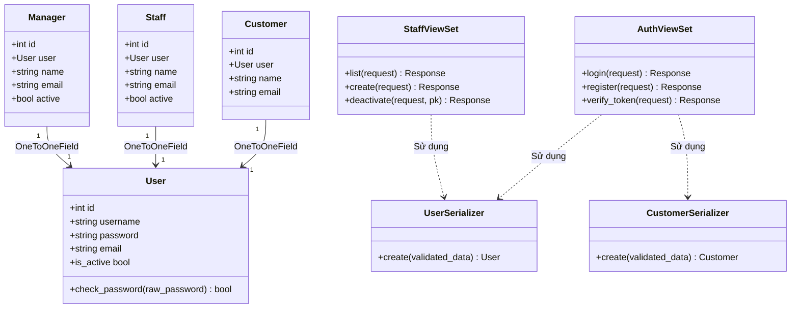

---

## 2.5 Thiết kế Cart Service

### 2.5.1 Mã nguồn Model (`cart-service/app/models.py`)
```python
from django.db import models

class Cart(models.Model):
    customer_id = models.IntegerField() # Khóa ngoại logic trỏ tới Customer.id ở user-service

class CartItem(models.Model):
    cart        = models.ForeignKey(Cart, on_delete=models.CASCADE)
    product_id  = models.IntegerField(null=True, blank=True) # Khóa ngoại logic trỏ tới Product.id
    quantity    = models.IntegerField()
```

### 2.5.2 Logic nghiệp vụ
Quy trình xử lý nghiệp vụ giỏ hàng được thiết kế dựa trên các nguyên tắc phân rã microservice:
1. **Khởi tạo và sở hữu:** Mỗi khách hàng (`Customer`) được liên kết logic với duy nhất một thực thể `Cart` thông qua `customer_id`. Khi khách hàng thêm sản phẩm lần đầu, hệ thống tự động tìm kiếm hoặc khởi tạo `Cart` mới.
2. **Thêm sản phẩm (Add-to-cart):**
   * Hệ thống kiểm tra xem cặp (`cart_id`, `product_id`) đã tồn tại trong bảng `CartItem` chưa.
   * Nếu đã tồn tại: Cập nhật tăng số lượng (`quantity = quantity + new_quantity`).
   * Nếu chưa tồn tại: Tạo mới bản ghi `CartItem` với số lượng tương ứng.
3. **Độc lập dữ liệu:** `cart-service` hoàn toàn không lưu thông tin chi tiết của sản phẩm (như tên, giá, hình ảnh) mà chỉ lưu trữ khóa logic `product_id`. Khi người dùng xem giỏ hàng, API Gateway (BFF) sẽ đóng vai trò điều phối (aggregator), thực hiện gọi đồng bộ sang `product-service` để lấy thông tin sản phẩm cập nhật và kiểm tra tồn kho (`stock`) thực tế trước khi hiển thị hoặc tiến hành thanh toán.

### 2.5.3 API của Cart Service
* `GET /carts/{customer_id}/` ─ Lấy chi tiết toàn bộ giỏ hàng của khách hàng (bao gồm danh sách các sản phẩm và số lượng).
* `POST /carts/add-item/` ─ Thêm một sản phẩm mới vào giỏ hàng.
* `PUT/PATCH /carts/update-item/` ─ Điều chỉnh số lượng (`quantity`) của một sản phẩm trong giỏ hàng.
* `DELETE /carts/remove-item/{product_id}/` ─ Loại bỏ một sản phẩm cụ thể ra khỏi giỏ hàng.
* `DELETE /carts/{customer_id}/` ─ Xóa sạch toàn bộ giỏ hàng (thường gọi khi người dùng đặt hàng thành công).

### 2.5.4 Sơ đồ lớp phân tích (Analytical Class Diagram)
Dưới đây là sơ đồ lớp phân tích biểu diễn các thành phần logic trong dịch vụ `cart-service`:

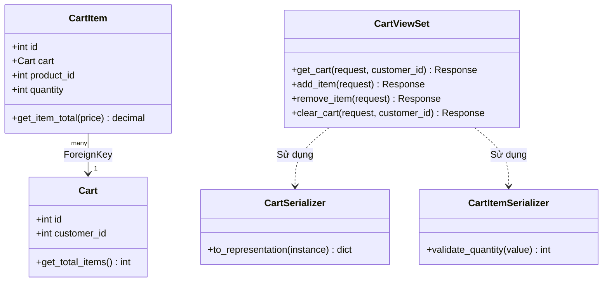

---

## 2.6 Thiết kế Order Service

### 2.6.1 Mã nguồn Model (`order-service/app/models.py`)
```python
from django.db import models

class Order(models.Model):
    STATUS_CHOICES = [
        ('pending',   'Chờ xác nhận'),
        ('confirmed', 'Đã xác nhận'),
        ('shipping',  'Đang giao'),
        ('delivered', 'Đã giao'),
        ('cancelled', 'Đã huỷ'),
    ]
    customer_id  = models.IntegerField()
    status       = models.CharField(max_length=20, choices=STATUS_CHOICES, default='pending')
    total_amount = models.DecimalField(max_digits=12, decimal_places=2, default=0)
    created_at   = models.DateTimeField(auto_now_add=True)

class OrderItem(models.Model):
    order          = models.ForeignKey(Order, on_delete=models.CASCADE, related_name='items')
    book_id        = models.IntegerField() # product_id của sản phẩm được mua
    quantity       = models.IntegerField()
    price_at_order = models.DecimalField(max_digits=10, decimal_places=2) # Giá khóa băng tại thời điểm mua
```

### 2.6.2 Logic nghiệp vụ
1. **Khóa giá sản phẩm (Price Freezing):** Nhằm tránh việc thay đổi giá sản phẩm trên hệ thống trong tương lai làm ảnh hưởng đến tính nhất quán của dữ liệu doanh thu, `order-service` thực hiện sao chép giá hiện thời của sản phẩm từ `product-service` và ghi nhận trực tiếp vào trường `price_at_order` của thực thể `OrderItem`.
2. **Quy trình Đặt hàng & Phối hợp (Order Orchestration):**
   * BFF Gateway nhận yêu cầu chốt đơn -> Lấy chi tiết giỏ hàng từ `cart-service` -> Lấy đơn giá thực tế từ `product-service`.
   * BFF gọi `order-service` tạo đơn hàng (`Order`) với trạng thái mặc định là `pending` (Chờ xác nhận).
   * BFF gửi lệnh xóa giỏ hàng sang `cart-service` đồng thời gửi yêu cầu tạo giao dịch thanh toán sang `payment-service` và tạo vận đơn sang `shipping-service`.
3. **Cập nhật trạng thái bất đồng bộ:** Khi `payment-service` gửi sự kiện `payment_processed` (Đã thanh toán) qua Redis Message Broker, `order-service` sẽ tự động tiêu thụ (consume) sự kiện này và chuyển trạng thái đơn hàng sang `confirmed` (Đã xác nhận).

### 2.6.3 API của Order Service
* `POST /orders/create/` ─ Khởi tạo đơn hàng mới kèm theo danh sách sản phẩm, số lượng và đơn giá đã chốt từ BFF.
* `GET /orders/{id}/` ─ Xem chi tiết thông tin một đơn đặt hàng cụ thể và danh sách sản phẩm đi kèm.
* `GET /orders/history/` ─ Lấy lịch sử mua hàng của khách hàng (lọc theo `customer_id`).
* `GET /orders/all/` ─ Lấy danh sách toàn bộ đơn hàng trên hệ thống (Staff/Manager).
* `PATCH /orders/{id}/status/` ─ Cập nhật trạng thái đơn hàng (Staff/Manager xử lý chốt đơn/giao hàng/hủy đơn).
* `POST /orders/{id}/cancel/` ─ Khách hàng gửi yêu cầu hủy đơn hàng (chỉ cho phép khi trạng thái đơn hàng là `pending`).

### 2.6.4 Sơ đồ lớp phân tích (Analytical Class Diagram)
Dưới đây là sơ đồ lớp phân tích mô tả cấu trúc logic của `order-service`:

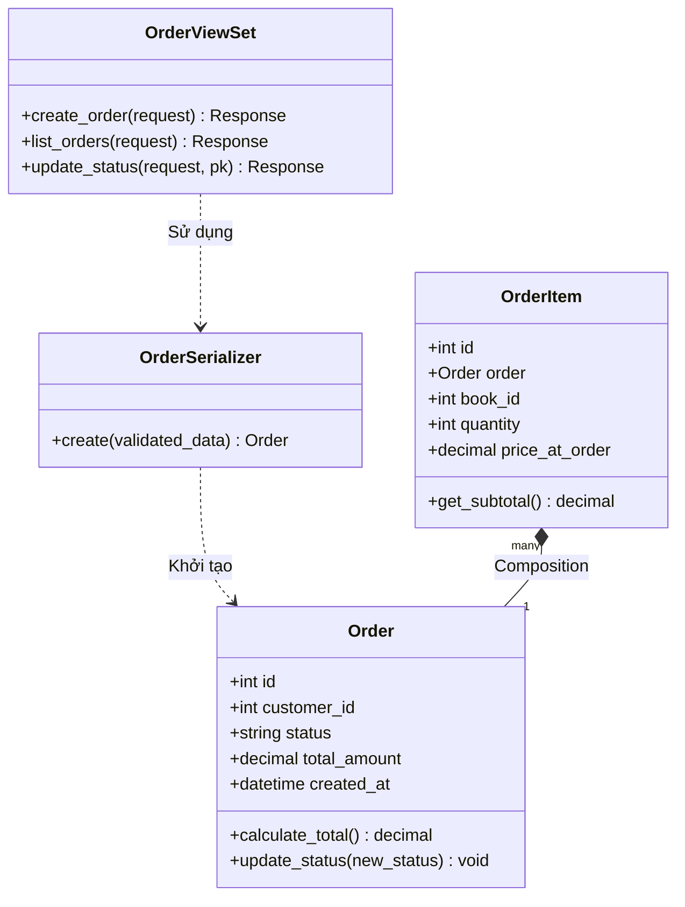

---

## 2.7 Thiết kế Payment Service

### 2.7.1 Mã nguồn Model (`payment-service/app/models.py`)
```python
from django.db import models

class Payment(models.Model):
    STATUS_CHOICES = [
        ('initiated', 'Khởi tạo'),
        ('paid', 'Đã thanh toán'),
        ('failed', 'Thất bại'),
        ('refunded', 'Đã hoàn tiền'),
        ('cancelled', 'Đã huỷ'),
    ]
    METHOD_CHOICES = [
        ('cod', 'COD'),
        ('bank', 'Chuyển khoản'),
        ('card', 'Thẻ'),
        ('wallet', 'Ví điện tử'),
    ]
    order_id       = models.IntegerField()
    customer_id    = models.IntegerField()
    amount         = models.DecimalField(max_digits=12, decimal_places=2, default=0)
    method         = models.CharField(max_length=20, choices=METHOD_CHOICES, default='cod')
    provider       = models.CharField(max_length=100, blank=True, default='')
    transaction_id = models.CharField(max_length=100, blank=True, default='')
    status         = models.CharField(max_length=20, choices=STATUS_CHOICES, default='initiated')
    created_at     = models.DateTimeField(auto_now_add=True)
    updated_at     = models.DateTimeField(auto_now=True)
```

### 2.7.2 Logic nghiệp vụ
1. **Khởi tạo giao dịch (Transaction Initialization):** Khi nhận được yêu cầu từ BFF Gateway, dịch vụ sẽ sinh bản ghi giao dịch mới với trạng thái mặc định là `initiated` (Khởi tạo).
2. **Xử lý thanh toán đa phương thức (Payment Gateway Mock):** Dịch vụ hỗ trợ COD, Chuyển khoản ngân hàng, Thẻ tín dụng, và Ví điện tử. Đối với các phương thức trực tuyến, hệ thống mô phỏng (mock) quá trình bắt tay với bên thứ ba (Momo, VNPay, Stripe) để xác thực giao dịch thành công và cập nhật trạng thái thanh toán sang `paid`.
3. **Phát sự kiện trạng thái (Event Publishing):** Ngay khi trạng thái thanh toán chuyển sang `paid` hoặc `cancelled`/`failed`, `payment-service` sẽ gửi sự kiện `payment_processed` lên Redis Broker nhằm kích hoạt luồng xác nhận đơn hàng bất đồng bộ ở `order-service` và thông báo tới `notification-service`.

### 2.7.3 API của Payment Service
* `POST /payments/create/` ─ Khởi tạo một giao dịch thanh toán nháp (trạng thái initiated) gắn liền với đơn đặt hàng.
* `GET /payments/{id}/` ─ Xem chi tiết thông tin và trạng thái của một giao dịch thanh toán cụ thể.
* `GET /payments/order/{order_id}/` ─ Tìm kiếm giao dịch thanh toán dựa trên mã đơn hàng (`order_id`).
* `PATCH /payments/{id}/status/` ─ Cập nhật trạng thái giao dịch thanh toán (ví dụ: chuyển từ initiated sang paid).
* `POST /payments/{id}/refund/` ─ Khởi chạy tiến trình hoàn tiền cho giao dịch thanh toán (khi đơn hàng tương ứng bị hủy).

### 2.7.4 Sơ đồ lớp phân tích (Analytical Class Diagram)
Dưới đây là sơ đồ lớp phân tích thể hiện cấu trúc xử lý thanh toán của `payment-service`:

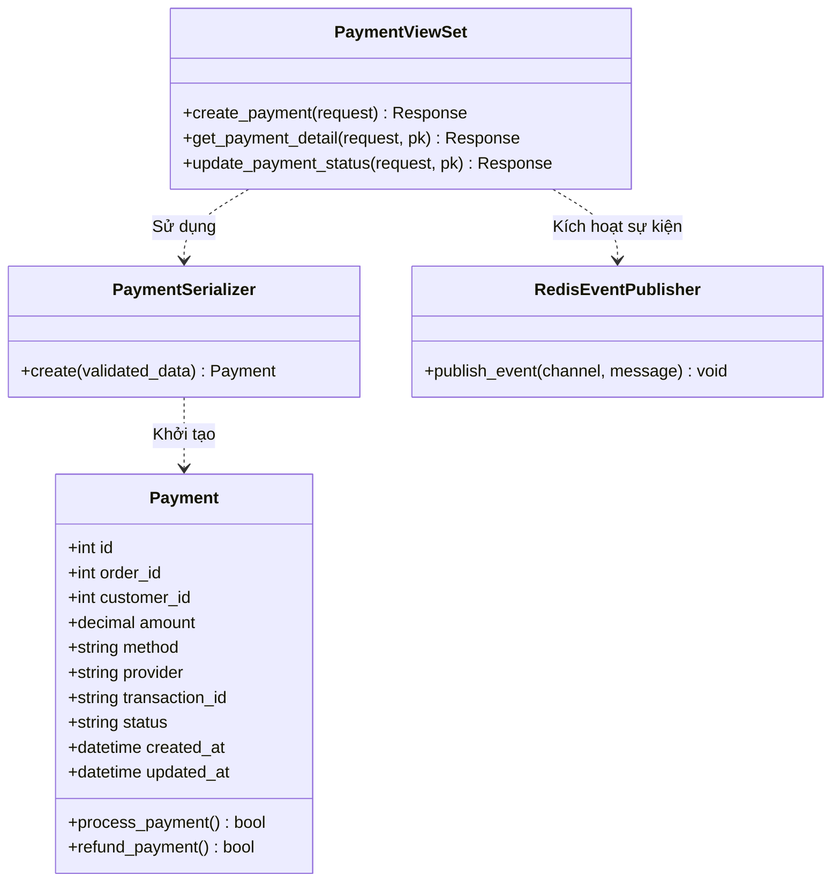

---

## 2.8 Thiết kế Shipping Service

### 2.8.1 Mã nguồn Model (`shipping-service/app/models.py`)
```python
from django.db import models

class Shipment(models.Model):
    STATUS_CHOICES = [
        ('pending', 'Chờ lấy hàng'),
        ('picked', 'Đã lấy hàng'),
        ('shipping', 'Đang giao'),
        ('delivered', 'Đã giao'),
        ('failed', 'Giao thất bại'),
        ('cancelled', 'Đã huỷ'),
    ]
    order_id        = models.IntegerField()
    customer_id     = models.IntegerField()
    receiver_name   = models.CharField(max_length=255, blank=True, default='')
    phone           = models.CharField(max_length=50, blank=True, default='')
    address         = models.TextField(blank=True, default='')
    carrier         = models.CharField(max_length=100, blank=True, default='')
    tracking_number = models.CharField(max_length=100, blank=True, default='')
    status          = models.CharField(max_length=20, choices=STATUS_CHOICES, default='pending')
    created_at      = models.DateTimeField(auto_now_add=True)
    updated_at      = models.DateTimeField(auto_now=True)
```

### 2.8.2 Logic nghiệp vụ
1. **Khởi tạo vận đơn (Shipment Initialization):** Khi nhận được tín hiệu tạo vận đơn từ BFF Gateway, dịch vụ ghi nhận thông tin địa chỉ giao hàng, thông tin liên lạc của người nhận và gắn trạng thái ban đầu là `pending` (Chờ lấy hàng).
2. **Gán đơn vị vận chuyển & Cấp mã vận đơn:** Khi đối tác giao hàng (carrier) tiếp nhận, dịch vụ cập nhật tên đơn vị vận chuyển (`carrier`), tạo ngẫu nhiên một mã vận đơn (`tracking_number`), và chuyển trạng thái sang `picked` (Đã lấy hàng) hoặc `shipping` (Đang giao).
3. **Đồng bộ trạng thái vận chuyển:** Nhân viên giao hàng cập nhật trạng thái đơn hàng thành `delivered` (Giao thành công) hoặc `failed` (Thất bại). Trạng thái này có thể được phát đi dưới dạng event để đồng bộ ngược lại `order-service` cập nhật trạng thái đơn hàng tương ứng.

### 2.8.3 API của Shipping Service
* `POST /shipments/create/` ─ Khởi tạo một vận đơn giao hàng mới (trạng thái pending) liên kết với đơn đặt hàng.
* `GET /shipments/{id}/` ─ Xem chi tiết thông tin, đối tác giao nhận và mã vận đơn của một vận đơn cụ thể.
* `GET /shipments/order/{order_id}/` ─ Tìm kiếm thông tin vận đơn dựa trên mã đơn hàng (`order_id`).
* `PATCH /shipments/{id}/status/` ─ Cập nhật trạng thái giao nhận (chuyển đổi giữa pending -> picked -> shipping -> delivered -> failed).
* `PATCH /shipments/{id}/carrier/` ─ Gán đơn vị giao nhận (`carrier`) và cập nhật mã vận đơn (`tracking_number`) cho vận đơn.

### 2.8.4 Sơ đồ lớp phân tích (Analytical Class Diagram)
Dưới đây là sơ đồ lớp phân tích thể hiện cấu trúc logic của dịch vụ `shipping-service`:

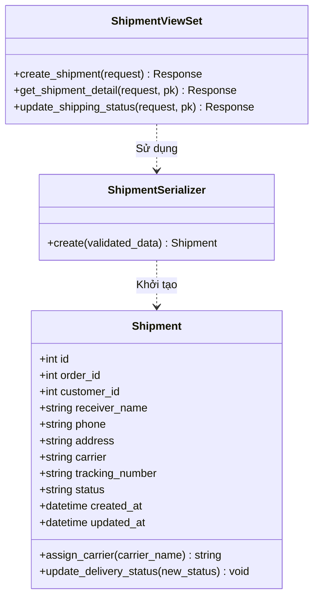

---

## 2.9 Luồng hệ thống tổng thể (Sequence Diagrams & Analysis)

### 2.9.1 Sơ đồ luồng hoạt động tổng thể (End-to-End Sequence Diagram)

Dưới đây là sơ đồ Sequence biểu diễn luồng hoạt động xuyên suốt 6 bước nghiệp vụ cốt lõi từ Đăng nhập, Xem sản phẩm, Thêm giỏ hàng, Đặt hàng, Thanh toán, đến Giao vận:

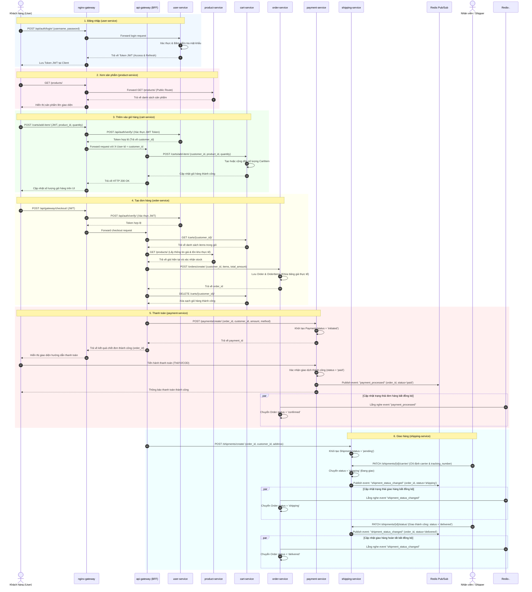

### 2.9.2 Phân tích luồng hoạt động hệ thống chi tiết

Quy trình hoạt động xuyên suốt qua các dịch vụ được phân tích chi tiết và minh họa bằng biểu đồ Sequence cho từng luồng nghiệp vụ nhỏ như sau:

#### 1. Luồng đăng nhập (User Login Workflow)
* **Giao tiếp:** Đồng bộ qua REST HTTP API.
* **Quy trình:** Client gửi thông tin tài khoản qua `nginx-gateway`. Nginx thực hiện định tuyến trực tiếp yêu cầu xuống `user-service`. Dịch vụ thực hiện đối sánh thông tin người dùng từ CSDL MySQL (`bookstore_user`) bằng cách băm mật khẩu và so khớp.
* **Kết quả:** `user-service` phản hồi về một cặp Token JWT gồm Access Token (hiệu lực ngắn) và Refresh Token (hiệu lực dài). Token này được Client lưu trữ cục bộ và gắn kèm vào Header (`Authorization: Bearer <token>`) trong mọi request tiếp theo lên các API được bảo vệ.

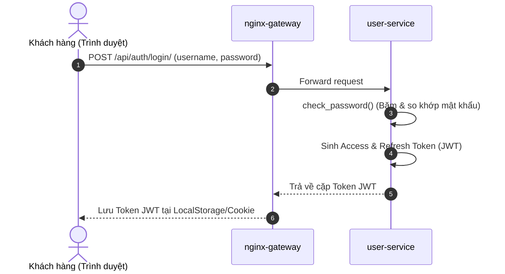

#### 2. Luồng xem sản phẩm (Product Catalog Discovery)
* **Giao tiếp:** Đồng bộ qua REST HTTP API.
* **Quy trình:** Đây là API công khai (Public Route), khách hàng truy cập trực tiếp thông qua API Gateway. Nginx chuyển tiếp yêu cầu đến `product-service`. Dịch vụ thực hiện truy vấn bảng `Product` trong cơ sở dữ liệu PostgreSQL (`bookstore_product`) để lấy danh sách sản phẩm.
* **Kết quả:** Toàn bộ thông tin hiển thị bao gồm tên, giá, loại sản phẩm và thông tin danh mục chi tiết được phản hồi về Client để hiển thị trên UI.

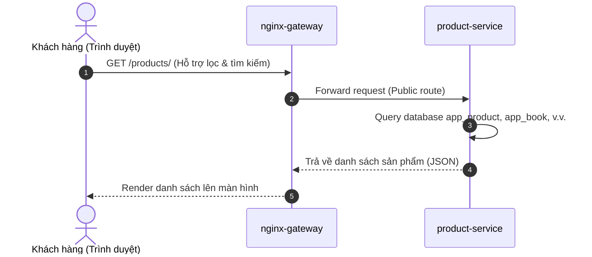

#### 3. Luồng thêm vào giỏ hàng (Add-to-cart Workflow)
* **Giao tiếp:** Gọi đồng bộ giữa Gateway và Microservices.
* **Xác thực:** Nginx Gateway nhận request kèm JWT Token, gọi dịch vụ nội bộ `/api/auth/verify/` của `user-service` để giải mã. Sau khi Token được xác nhận hợp lệ, Nginx trích xuất thuộc tính `user_id` từ token payload và chuyển tiếp yêu cầu xuống BFF API Gateway kèm theo Header định danh khách hàng (`X-User-Id`).
* **Nghiệp vụ:** BFF gọi API `POST /carts/add-item/` xuống `cart-service`. Dịch vụ tiến hành tìm kiếm giỏ hàng hiện tại của `customer_id`. Nếu giỏ hàng đã tồn tại, sản phẩm (`product_id`) được kiểm tra; nếu đã có sẵn thì cộng dồn số lượng (`quantity`), ngược lại thêm mới một thực thể `CartItem`.
* **Kết quả:** Phản hồi HTTP 200 OK thông báo giỏ hàng được cập nhật thành công lên UI.

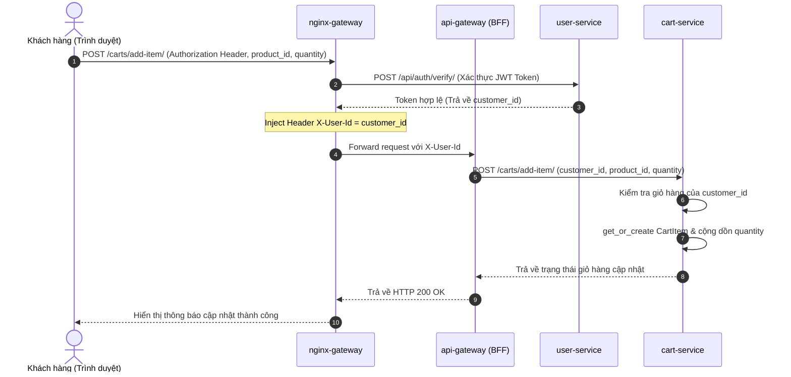

#### 4. Luồng tạo đơn hàng (Order Creation & Checkout)
* **Giao tiếp:** Điều phối đồng bộ (Orchestration) thông qua API Gateway (BFF).
* **Quy trình:**
  1. Khách hàng thực hiện gửi yêu cầu Checkout. API Gateway (BFF) bắt đầu vai trò Orchestrator.
  2. BFF gọi `cart-service` để lấy toàn bộ các mục hàng hiện có của khách hàng.
  3. BFF gọi `product-service` để kiểm tra đơn giá thực tế tại thời điểm đặt và đối soát lượng tồn kho (`stock`) xem còn đủ cung ứng hay không.
  4. Sau khi các điều kiện kiểm tra hợp lệ, BFF gọi `order-service` để khởi tạo đơn đặt hàng mới. Dịch vụ lưu thông tin đơn đặt hàng (`Order`) với trạng thái mặc định là `pending` và ghi băng đơn giá thực tế vào `price_at_order` của từng `OrderItem`.
  5. Khi đơn hàng được xác nhận khởi tạo thành công, BFF lập tức gửi yêu cầu xóa giỏ hàng sang `cart-service` để tránh trùng lặp.

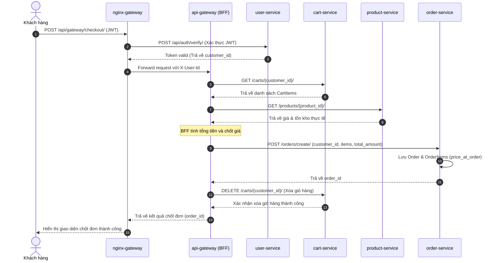

#### 5. Luồng thanh toán (Payment Processing)
* **Giao tiếp:** Gọi đồng bộ khởi tạo và đồng bộ trạng thái bất đồng bộ qua Redis Event Broker.
* **Quy trình:**
  1. BFF gọi dịch vụ `payment-service` để khởi tạo bản ghi thanh toán tương ứng cho đơn hàng vừa được tạo (trạng thái ban đầu là `initiated`). BFF trả về kết quả Checkout thành công cùng mã `order_id` cho Client.
  2. Khách hàng được chuyển hướng sang cổng thanh toán hoặc giao diện xác nhận (COD/Bank). Sau khi khách hàng hoàn tất giao dịch thanh toán thành công, `payment-service` cập nhật trạng thái bản ghi thanh toán sang `paid` (Đã thanh toán).
  3. Ngay lập tức, `payment-service` gửi sự kiện phát đi (publish) mang tên `payment_processed` chứa payload (`order_id`, `status='paid'`) lên Redis Message Broker.
  4. Dịch vụ `order-service` lắng nghe (subscribe) sự kiện này trên Redis Broker, nhận thông tin và tự động cập nhật trạng thái đơn hàng tương ứng sang `confirmed` (Đã xác nhận).

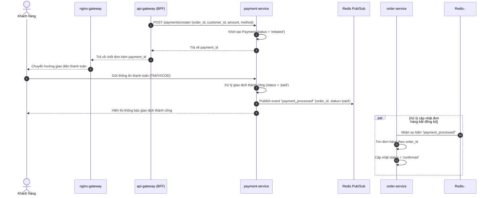

#### 6. Luồng giao hàng (Shipping Dispatch Workflow)
* **Giao tiếp:** Khởi tạo đồng bộ và đồng bộ trạng thái vận chuyển bất đồng bộ qua Redis Event Broker.
* **Quy trình:**
  1. BFF thực hiện gửi yêu cầu tạo vận đơn giao hàng sang `shipping-service`. Vận đơn được tạo lập với trạng thái `pending` (Chờ lấy hàng).
  2. Nhân viên vận hành (Staff) tiếp nhận, chỉ định đơn vị vận chuyển (`carrier`), tạo mã vận đơn (`tracking_number`) thông qua API `PATCH /shipments/{id}/carrier/`. Trạng thái vận đơn đổi sang `shipping` (Đang giao).
  3. Dịch vụ `shipping-service` bắn sự kiện `shipment_status_changed` (status='shipping') qua Redis Broker. `order-service` bắt được sự kiện này và tự động chuyển trạng thái đơn hàng tương ứng thành `shipping`.
  4. Khi khách hàng nhận được hàng thành công, nhân viên giao hàng (Shipper) cập nhật trạng thái vận đơn thành `delivered` (Giao thành công). Sự kiện `shipment_status_changed` (status='delivered') được gửi tiếp qua Redis Broker, giúp `order-service` tự động cập nhật đơn hàng thành `delivered` (Đã giao hàng thành công), kết thúc chu kỳ vòng đời của đơn hàng.

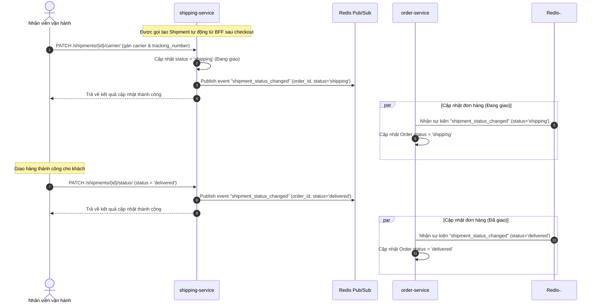

---

## 2.10 Hướng dẫn thực hành & Mapping Class Diagram

### 2.10.1 Biểu đồ lớp hệ thống (System Class Diagram)

Biểu đồ lớp dưới đây thể hiện cấu trúc các Model và mối quan hệ giữa chúng trong toàn hệ thống. Mặc dù các thực thể nằm ở các service khác nhau, mối quan hệ giữa chúng được liên kết logic qua các khóa `ID` (Logical Foreign Keys).

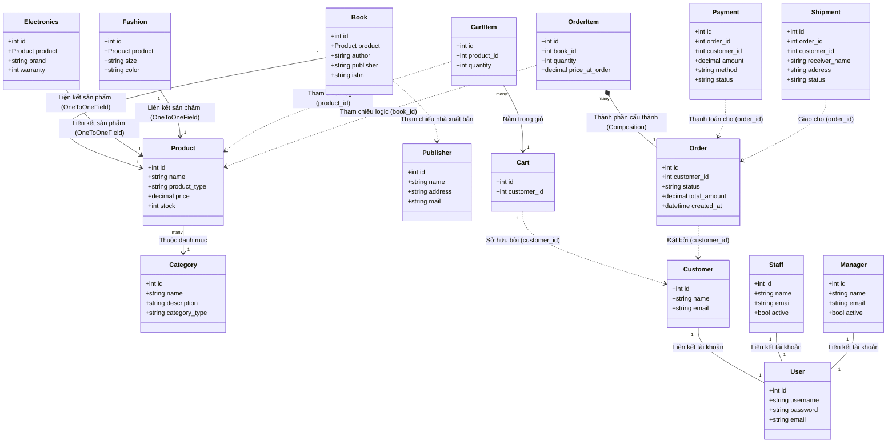

---

### 2.10.2 Mapping Class Diagram sang Database & SQL Schemas

Theo nguyên tắc thiết kế Microservices, cơ sở dữ liệu được phân chia độc lập giữa hai động cơ: **MySQL** (cho User Service phục vụ tính năng bảo mật và phân quyền) và **PostgreSQL** (cho 9 services còn lại).

#### 1. User Service Database (MySQL - `bookstore_user`)
```sql
CREATE TABLE auth_user (
    id INT AUTO_INCREMENT PRIMARY KEY,
    username VARCHAR(150) NOT NULL UNIQUE,
    password VARCHAR(128) NOT NULL,
    email VARCHAR(254) NOT NULL
);

CREATE TABLE app_customer (
    id INT AUTO_INCREMENT PRIMARY KEY,
    name VARCHAR(255) NOT NULL,
    email VARCHAR(254) NOT NULL UNIQUE,
    user_id INT UNIQUE,
    FOREIGN KEY (user_id) REFERENCES auth_user(id) ON DELETE CASCADE
);

CREATE TABLE app_staff (
    id INT AUTO_INCREMENT PRIMARY KEY,
    name VARCHAR(255) NOT NULL,
    email VARCHAR(254) NOT NULL UNIQUE,
    active BOOLEAN NOT NULL DEFAULT TRUE,
    created_at DATETIME NOT NULL,
    user_id INT UNIQUE,
    FOREIGN KEY (user_id) REFERENCES auth_user(id) ON DELETE CASCADE
);

CREATE TABLE app_manager (
    id INT AUTO_INCREMENT PRIMARY KEY,
    name VARCHAR(255) NOT NULL,
    email VARCHAR(254) NOT NULL UNIQUE,
    active BOOLEAN NOT NULL DEFAULT TRUE,
    created_at DATETIME NOT NULL,
    user_id INT UNIQUE,
    FOREIGN KEY (user_id) REFERENCES auth_user(id) ON DELETE CASCADE
);
```

#### 2. Product Service Database (PostgreSQL - `bookstore_product`)
```sql
CREATE TABLE app_publisher (
    id SERIAL PRIMARY KEY,
    name VARCHAR(255) NOT NULL,
    address TEXT NOT NULL DEFAULT '',
    mail VARCHAR(254) UNIQUE NOT NULL
);

CREATE TABLE app_category (
    id SERIAL PRIMARY KEY,
    name VARCHAR(255) NOT NULL,
    description TEXT NOT NULL DEFAULT '',
    category_type VARCHAR(50) NOT NULL DEFAULT 'clothing'
);

CREATE TABLE app_product (
    id SERIAL PRIMARY KEY,
    name VARCHAR(255) NOT NULL,
    product_type VARCHAR(50) NOT NULL,
    price DECIMAL(12, 2) NOT NULL,
    stock INT NOT NULL
);

CREATE TABLE app_book (
    id SERIAL PRIMARY KEY,
    product_id INT UNIQUE NOT NULL REFERENCES app_product(id) ON DELETE CASCADE,
    author VARCHAR(255) NOT NULL,
    publisher VARCHAR(255) NOT NULL,
    isbn VARCHAR(20) NOT NULL
);

CREATE TABLE app_electronics (
    id SERIAL PRIMARY KEY,
    product_id INT UNIQUE NOT NULL REFERENCES app_product(id) ON DELETE CASCADE,
    brand VARCHAR(100) NOT NULL,
    warranty INT NOT NULL
);

CREATE TABLE app_fashion (
    id SERIAL PRIMARY KEY,
    product_id INT UNIQUE NOT NULL REFERENCES app_product(id) ON DELETE CASCADE,
    size VARCHAR(10) NOT NULL,
    color VARCHAR(50) NOT NULL
);
```

#### 3. Cart Service Database (PostgreSQL - `bookstore_cart`)
```sql
CREATE TABLE app_cart (
    id SERIAL PRIMARY KEY,
    customer_id INT NOT NULL
);

CREATE TABLE app_cartitem (
    id SERIAL PRIMARY KEY,
    cart_id INT NOT NULL REFERENCES app_cart(id) ON DELETE CASCADE,
    product_id INT,
    quantity INT NOT NULL
);
```

#### 4. Order Service Database (PostgreSQL - `bookstore_order`)
```sql
CREATE TABLE app_order (
    id SERIAL PRIMARY KEY,
    customer_id INT NOT NULL,
    status VARCHAR(20) NOT NULL DEFAULT 'pending',
    total_amount DECIMAL(12, 2) NOT NULL DEFAULT 0.00,
    created_at TIMESTAMP WITH TIME ZONE NOT NULL
);

CREATE TABLE app_orderitem (
    id SERIAL PRIMARY KEY,
    order_id INT NOT NULL REFERENCES app_order(id) ON DELETE CASCADE,
    book_id INT NOT NULL,
    quantity INT NOT NULL,
    price_at_order DECIMAL(10, 2) NOT NULL
);
```

#### 5. Payment Service Database (PostgreSQL - `bookstore_payment`)
```sql
CREATE TABLE app_payment (
    id SERIAL PRIMARY KEY,
    order_id INT NOT NULL,
    customer_id INT NOT NULL,
    amount DECIMAL(12, 2) NOT NULL,
    method VARCHAR(20) NOT NULL DEFAULT 'cod',
    provider VARCHAR(100) NOT NULL DEFAULT '',
    transaction_id VARCHAR(100) NOT NULL DEFAULT '',
    status VARCHAR(20) NOT NULL DEFAULT 'initiated',
    created_at TIMESTAMP WITH TIME ZONE NOT NULL,
    updated_at TIMESTAMP WITH TIME ZONE NOT NULL
);
```

#### 6. Shipping Service Database (PostgreSQL - `bookstore_shipping`)
```sql
CREATE TABLE app_shipment (
    id SERIAL PRIMARY KEY,
    order_id INT NOT NULL,
    customer_id INT NOT NULL,
    receiver_name VARCHAR(255) NOT NULL DEFAULT '',
    phone VARCHAR(50) NOT NULL DEFAULT '',
    address TEXT NOT NULL DEFAULT '',
    carrier VARCHAR(100) NOT NULL DEFAULT '',
    tracking_number VARCHAR(100) NOT NULL DEFAULT '',
    status VARCHAR(20) NOT NULL DEFAULT 'pending',
    created_at TIMESTAMP WITH TIME ZONE NOT NULL,
    updated_at TIMESTAMP WITH TIME ZONE NOT NULL
);
```

---

### 2.10.3 So sánh động cơ cơ sở dữ liệu sử dụng

| Tiêu chí | MySQL (dùng cho user-service) | PostgreSQL (dùng cho các core service khác) |
| :--- | :--- | :--- |
| **Hiệu năng** | Rất tốt trong các truy vấn đọc đơn giản, ghi logs và xác thực tài khoản. | Cực tốt đối với các truy vấn phức tạp, phân trang lớn. |
| **Hỗ trợ kiểu JSON** | Hỗ trợ cơ bản. | Rất mạnh (`JSONB` được lập chỉ mục GIN giúp tìm kiếm thuộc tính sản phẩm cực nhanh). |
| **Mở rộng** | Phù hợp với các hệ thống phân quyền (RBAC) phổ thông. | Hỗ trợ rất tốt các kiểu dữ liệu nâng cao, các cấu trúc khóa logic phức tạp. |

---

## 2.11 Kết luận
* **Linh hoạt và Độc lập:** Kiến trúc Microservices cho phép mỗi thành phần nghiệp vụ (Sách, Giao hàng, Thanh toán) vận hành độc lập, giảm thiểu rủi ro lỗi dây chuyền cho toàn bộ hệ thống bán sách trực tuyến.
* **Tận dụng Django & DRF:** Giúp rút ngắn thời gian phát triển và cung cấp giao diện REST API chuẩn hóa nhanh chóng.
* **Tầm quan trọng của DDD:** Việc xác định đúng các ranh giới ngữ cảnh (Bounded Context) từ ban đầu giúp phân chia cơ sở dữ liệu độc lập một cách hợp lý (Database-per-Service), tạo tiền đề vững chắc cho việc thiết kế và mở rộng quy mô hệ thống.
