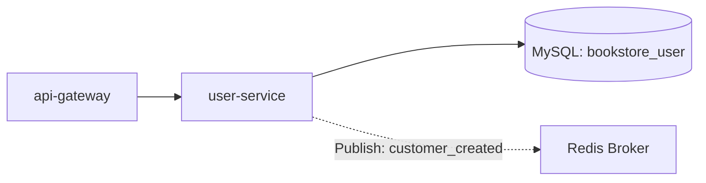
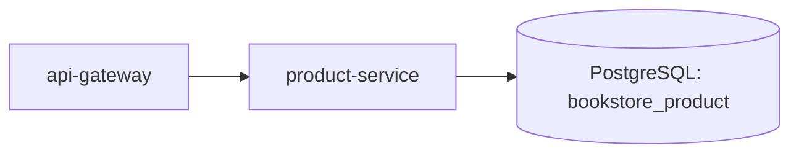
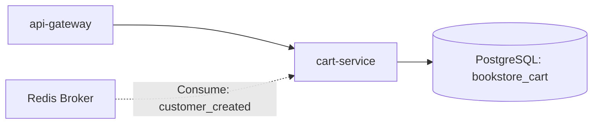
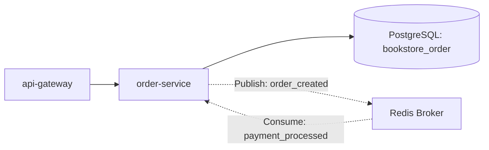
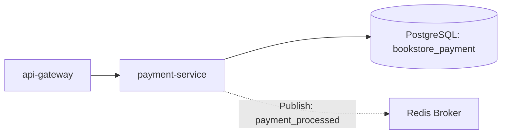
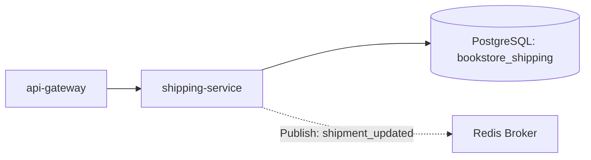
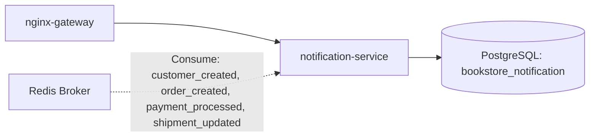
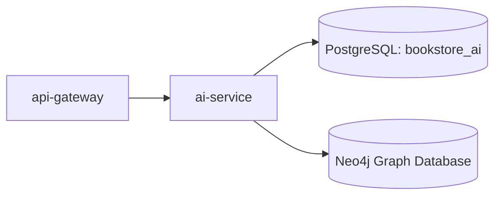

## Kiến trúc tổng thể (Overall Architecture)

Hệ thống sử dụng mô hình cổng vào thống nhất **API Gateway** qua Nginx, tách biệt hoàn toàn giữa phần hiển thị giao diện (**Frontend UI**) và phần điều phối API (**Backend For Frontend - BFF**), kết hợp cơ chế giao tiếp đồng bộ REST HTTP và bất đồng bộ qua **Redis Message Broker**.

```mermaid
flowchart TD
  user[User Browser] -- "HTTP (Port 8000)" --> nginxGateway[nginx-gateway (Reverse Proxy)]

  %% Nginx Gateway Routing
  nginxGateway -- "/" --> frontend[frontend (UI Django)]
  nginxGateway -- "/api/gateway/" --> apiGateway[api-gateway (BFF Django)]
  nginxGateway -- "/api/notifications/" --> notificationService[notification-service]

  %% Frontend to BFF communication
  frontend -- "REST API requests" --> nginxGateway

  %% BFF API Gateway / Orchestrator Calls
  apiGateway --> userService[user-service (Port 8001)]
  apiGateway --> productService[product-service (Port 8002)]
  apiGateway --> cartService[cart-service (Port 8003)]
  apiGateway --> orderService[order-service (Port 8004)]
  apiGateway --> reviewService[review-service (Port 8005)]
  apiGateway --> shippingService[shipping-service (Port 8006)]
  apiGateway --> paymentService[payment-service (Port 8007)]
  apiGateway --> catalogueService[catalogue-service (Port 8008)]
  apiGateway --> aiService[ai-service (Port 8011)]

  %% Direct Internal Service Calls
  catalogueService --> productService
  catalogueService --> reviewService
  aiService --> neo4j[(Neo4j Graph Database)]

  %% Redis Pub/Sub Asynchronous Messaging
  redis[Redis Message Broker (Port 6379)]

  userService -. "Publish: customer_created" .-> redis
  orderService -. "Publish: order_created" .-> redis
  paymentService -. "Publish: payment_processed" .-> redis
  shippingService -. "Publish: shipment_updated" .-> redis

  redis -. "Consume" .-> cartService
  redis -. "Consume" .-> orderService
  redis -. "Consume" .-> notificationService
```

---

## 1. nginx-gateway (API Gateway Entrypoint & Authentication)

Nginx đóng vai trò là một reverse proxy, cổng vào duy nhất (Single Entrypoint) cho mọi traffic từ Client, và là nơi xử lý **Xác thực tập trung (Centralized Authentication)** sử dụng module `auth_request` của Nginx:

- **Routing định tuyến**:
  - Đường dẫn `/`: Chuyển tiếp tới `frontend:8000` để render các trang HTML giao diện. Không yêu cầu xác thực ở mức Gateway (xử lý redirect ở tầng UI nếu cần).
  - Đường dẫn `/api/gateway/`: Chuyển tiếp tới `api-gateway:8000` (BFF) cho các yêu cầu nghiệp vụ JSON. Yêu cầu xác thực tập trung.
  - Đường dẫn `/api/notifications/`: Chuyển tiếp trực tiếp tới `notification-service:8000`. Yêu cầu xác thực tập trung.

- **Cơ chế Xác thực Tập trung (Centralized Auth)**:
  - Khi client gửi request đến các đường dẫn được bảo vệ (`/api/gateway/` và `/api/notifications/`), Nginx sẽ thực hiện một subrequest nội bộ tới `/api/auth/verify/` thuộc `user-service`.
  - Nginx tự động trích xuất JWT Token từ Header `Authorization` hoặc Cookie `access_token` của client để map vào Header `Authorization: Bearer <token>` gửi tới `user-service`.
  - Nếu `user-service` phản hồi thành công (`200 OK`), Nginx sẽ trích xuất các thông tin định danh của user từ response headers (như `X-User-Id`, `X-User-Email`, `X-User-Role`, `X-User-Profile-Id`, `X-User-Superuser`, `X-User-Username`) để chuyển tiếp xuống các service phía sau.
  - Để ngăn chặn giả mạo thông tin, Nginx sẽ ghi đè và làm sạch tất cả các header `X-User-*` được gửi trực tiếp từ client trước khi xử lý.
  - Nếu `user-service` phản hồi lỗi (`401 Unauthorized`), Nginx sẽ chặn request lập tức và trả về mã lỗi 401 cho client mà không chuyển tiếp tới backend.
  - Phía backend, `JWTAuthenticationMiddleware` của `api-gateway` và `frontend` sẽ đọc các header `X-User-*` được Nginx inject để dựng đối tượng `request.user`. Nếu chạy local không qua gateway, middleware sẽ tự động decode token trong cookie/session làm phương án fallback.

---

## 2. frontend (Web UI)

Service phục vụ giao diện người dùng, hoàn toàn phi trạng thái (stateless) về mặt cơ sở dữ liệu và trao đổi token JWT thông qua Signed Session Cookies.

```mermaid
flowchart LR
  browser[Browser] --> nginx[nginx-gateway] --> frontend[frontend (UI)]
  frontendDb[(PostgreSQL: bookstore_frontend)]
  frontend --> frontendDb
```

---

## 3. api-gateway (BFF - Backend For Frontend)

Service đóng vai trò điều phối, tổng hợp dữ liệu (API Aggregation) từ các microservices nghiệp vụ để trả về các cấu trúc JSON sạch cho Client.

```mermaid
flowchart LR
  nginx[nginx-gateway] --> bff[api-gateway (BFF)]
  bffDb[(PostgreSQL: bookstore_gateway)]
  bff --> bffDb
```

---

## 4. user-service

Chịu trách nhiệm quản lý tài khoản và phân quyền cho ba thực thể: Khách hàng (Customer), Nhân viên (Staff), Quản lý (Manager).



---

## 5. product-service

Quản lý danh mục sản phẩm bao gồm Sách (Book), Thời trang (Clothing), Thiết bị điện tử (Electronic), Danh mục (Category), và Nhà xuất bản (Publisher).



---

## 6. cart-service

Quản lý giỏ hàng của khách hàng. Khởi tạo giỏ hàng bất đồng bộ khi nhận được event `customer_created`.



---

## 7. order-service

Xử lý vòng đời đơn hàng. Cập nhật trạng thái đơn hàng bất đồng bộ từ `pending` sang `confirmed` khi nhận được event `payment_processed`.



---

## 8. payment-service

Xử lý các giao dịch thanh toán đơn hàng. Khi một giao dịch thanh toán thay đổi trạng thái, service phát đi sự kiện `payment_processed`.



---

## 9. shipping-service

Quản lý vận đơn giao hàng. Phát đi sự kiện `shipment_updated` khi có thay đổi trạng thái vận chuyển.



---

## 10. notification-service

Tổng hợp và lưu trữ nhật ký thông báo (Email, SMS, System) cho khách hàng từ các luồng sự kiện trong hệ thống bằng cách consume tất cả các kênh pub/sub trên Redis.



---

## 11. ai-service

Sử dụng mô hình học sâu PyTorch LSTM kết hợp cơ sở dữ liệu đồ thị Neo4j và độ tương đồng vector FAISS để chấm điểm hỗn hợp (Hybrid Scoring) gợi ý sản phẩm (Sách, Quần áo, Đồ điện tử). Sử dụng mô hình Gemini 3.5 Flash cùng chỉ mục FAISS để vận hành chatbot RAG tư vấn bán hàng đa danh mục bằng tiếng Việt.


