## Kiến trúc tổng thể (Overall)

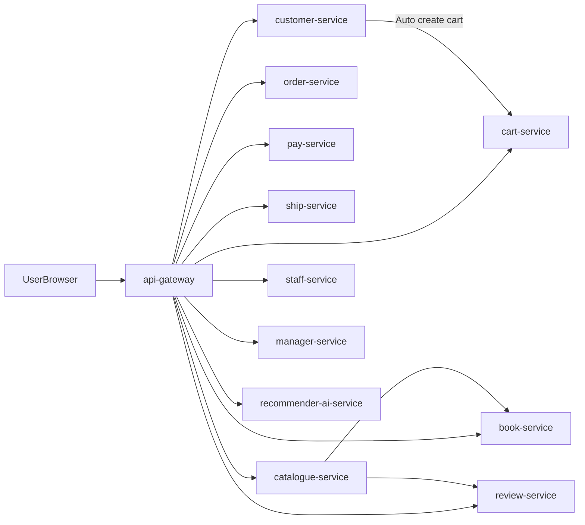

## api-gateway

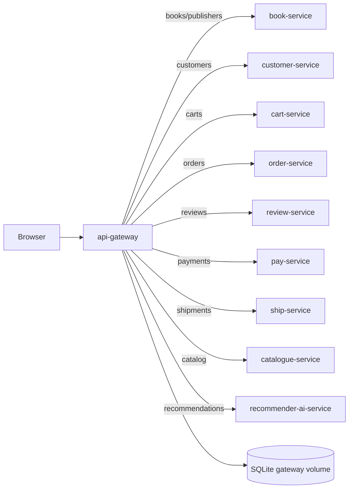

## book-service

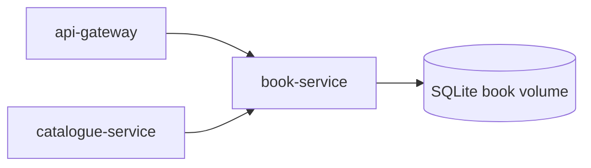

## customer-service

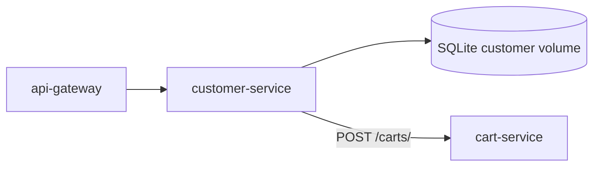

## cart-service

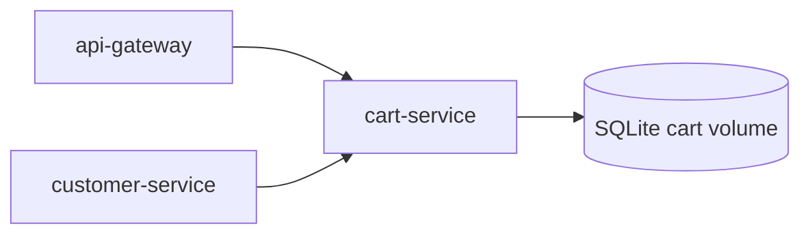

## order-service

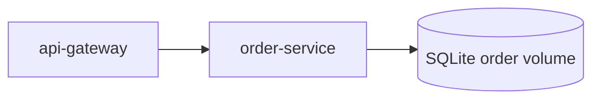

## pay-service

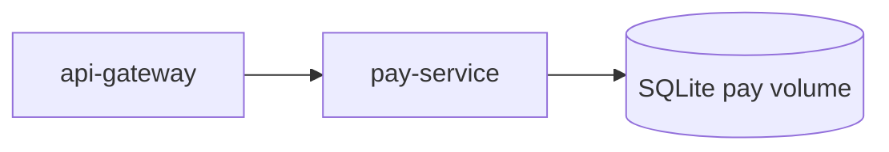

## ship-service

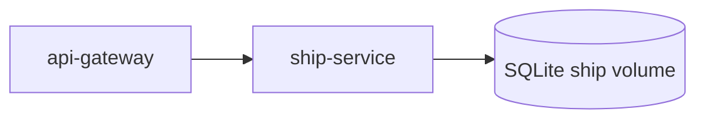

## review-service

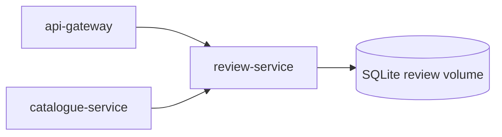

## catalogue-service

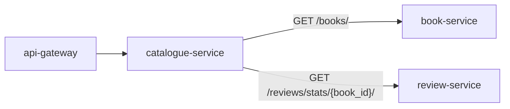

## staff-service

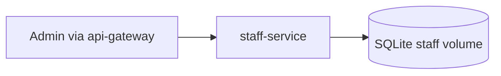

## manager-service

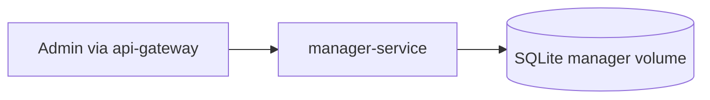

## recommender-ai-service

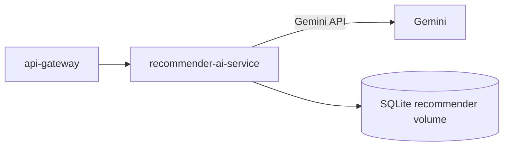

