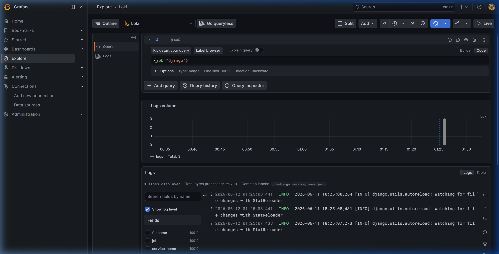
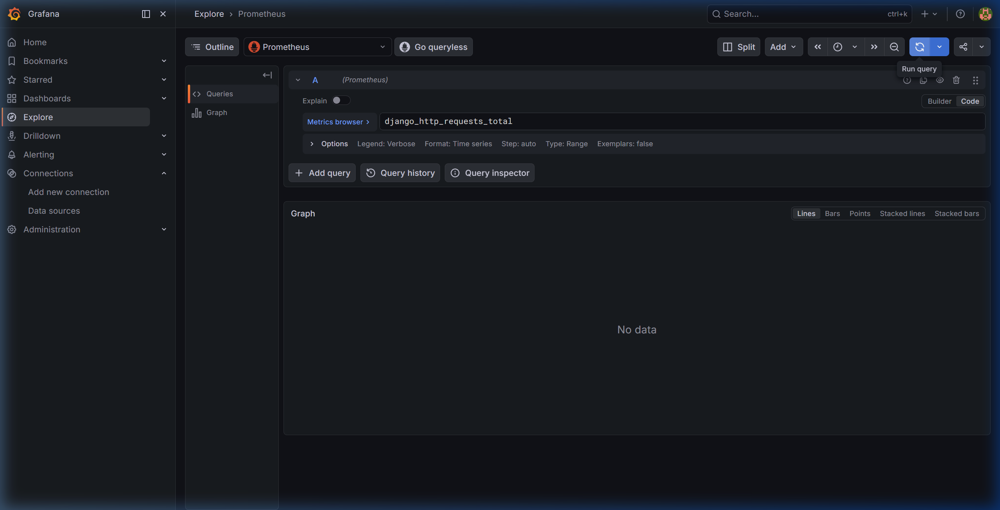

# Hướng dẫn chi tiết: Hệ thống Giám sát & Quản lý Log tập trung (Prometheus + Loki + Grafana)

Hệ thống Bookstore Microservices được chuẩn hóa và bổ sung giải pháp giám sát hiệu năng cùng thu thập log tập trung sử dụng bộ công cụ **PLG Stack** (Prometheus, Loki, Promtail, Grafana). Giải pháp này được thiết kế tối ưu hóa tài nguyên phần cứng (RAM < 1GB) phù hợp cho các máy chủ có cấu hình vừa phải.

---

## 🏗️ 1. Kiến trúc Hệ thống Giám sát

Sơ đồ hoạt động của hệ thống giám sát và quản lý log:

```
+-------------------------------------------------------------+
|                     Môi trường Microservices                |
|                                                             |
|   +---------------+     +---------------+     +---------+   |
|   |  api-gateway  |     |   frontend    |     |  user   |   |
|   |  (Django BFF) |     |   (Django UI) |     |  ...    |   |
|   +-------+-------+     +-------+-------+     +----+----+   |
|           | /metrics              | /metrics       | /metrics
|           v                       v                v        |
|      [Prometheus Metrics Middleware]               |        |
|                    |                               |        |
|                    +---------------+---------------+        |
|                                    |                        |
+------------------------------------|------------------------+
                                     | Scrape (Port 9090)
                                     v
                           +--------------------+
                           |    Prometheus      | <=== (Data Source)
                           +--------------------+           ||
                                                            ||
+-----------------------------------------------------------||+
|                     Hệ thống Quản lý Logs                 |||
|                                                           |||
|  +---------------------+        +--------------------+    |||
|  |  Nginx Gateway Log  |        | Django Service Log |    |||
|  |   (nginx_logs)      |        |   (django_logs)    |    |||
|  +----------+----------+        +----------+---------+    |||
|             |                              |              |||
|             +--------------+---------------+              |||
|                            | Tailed                       |||
|                            v                              |||
|                       [Promtail]                          |||
|                            | Port 3100                    |||
|                            v                              |||
|                        [Loki] <=============================|
|                                  (Data Source)            |
+-----------------------------------------------------------+
                                     ||
                                     v
                           +--------------------+
                           |    Grafana UI      | (Port 3000)
                           +--------------------+
```

---

## 📂 2. Cấu trúc thư mục & các file cấu hình

Các file cấu hình và mã nguồn tích hợp được phân bổ như sau:

- **Công cụ Giám sát (Tools)**:
  - `tools/prometheus/prometheus.yml`: Cấu hình scrape targets (`api-gateway`, `frontend`, `user-service`).
  - `tools/loki/loki-config.yaml`: Cấu hình lưu trữ và giới hạn cho Loki.
  - `tools/promtail/promtail-config.yaml`: Cấu hình thu thập log của Django và Nginx.
  - `tools/grafana/provisioning/datasources/datasources.yaml`: Cấu hình tự động kết nối Prometheus và Loki.
- **Tích hợp Core Services**:
  - `api-gateway/api_gateway/metrics.py`: Custom middleware và view xuất metrics cho BFF.
  - `frontend/api_gateway/metrics.py`: Custom middleware và view xuất metrics cho Frontend.
  - `user-service/app/metrics.py`: Custom middleware và view xuất metrics cho User Service.

---

## 🛠️ 3. Mã nguồn và Tích hợp Chi tiết

### 3.1 Custom Prometheus Middleware & View
Để tránh cài đặt thư viện nặng như `django-prometheus` đòi hỏi biên dịch hoặc các network dependency chập chờn khi build container, hệ thống sử dụng một bộ custom metrics middleware viết thuần bằng Python, thread-safe, ghi nhận số lượng request và độ trễ vào biến toàn cục:

```python
# metrics.py (Trích dẫn logic chính)
import time
import threading

class PrometheusMetrics:
    def __init__(self):
        self.lock = threading.Lock()
        self.request_count = {}  # (method, path, status) -> count
        self.request_latency = {}  # (method, path, status) -> sum_seconds

    def record_request(self, method, path, status, duration):
        key = (method, path, status)
        with self.lock:
            self.request_count[key] = self.request_count.get(key, 0) + 1
            self.request_latency[key] = self.request_latency.get(key, 0.0) + duration
```

Endpoint `/metrics/` sẽ định dạng lại các chỉ số này sang chuẩn Prometheus:
```text
# HELP django_http_requests_total Total number of HTTP requests.
# TYPE django_http_requests_total counter
django_http_requests_total{method="GET",path="/",status="200"} 42
```

### 3.2 Khắc phục lỗi cấu hình Loki (Troubleshooting Loki Setup)
Trong quá trình triển khai, Loki phiên bản mới (`grafana/loki:latest`) yêu cầu schema cấu hình v13 để tự động hỗ trợ structured metadata. Khi chạy với file config schema v11, container Loki sẽ thoát với lỗi:
> *CONFIG ERROR: schema v13 is required to store Structured Metadata and use native OTLP ingestion, your schema version is v11. Set `allow_structured_metadata: false` in the `limits_config` section...*

**Giải pháp khắc phục:**
Cập nhật file `tools/loki/loki-config.yaml` để tắt structured metadata:
```yaml
limits_config:
  reject_old_samples: true
  reject_old_samples_max_age: 168h
  allow_structured_metadata: false
```
Nhờ đó, Loki khởi chạy ổn định, tiêu thụ rất ít RAM (~150MB) và lưu trữ log dưới dạng plain text/TSDB nén cực kỳ tiết kiệm bộ nhớ.

---

## 🚀 4. Hướng dẫn sử dụng chi tiết

### 4.1 Khởi động hệ thống giám sát
Hệ thống giám sát được khai báo đầy đủ trong `docker-compose.yml` và được khởi động đồng thời khi chạy dự án:
```bash
# Khởi động toàn bộ các service và PLG stack
docker compose up -d
```

Để kiểm tra trạng thái hoạt động của PLG stack:
```bash
docker compose ps
```
Đảm bảo các container sau đang ở trạng thái `Up`:
- `bookstore-prometheus` (Port `9090`)
- `bookstore-loki` (Port `3100`)
- `bookstore-promtail` (Tải log tự động)
- `bookstore-grafana` (Port `3000`)

---

### 4.2 Truy cập Grafana Dashboard và Query dữ liệu

1. Mở trình duyệt truy cập: **`http://localhost:3000`**
2. Đăng nhập bằng tài khoản mặc định:
   - **Username**: `admin`
   - **Password**: `admin`
   *(Nhấp **Skip** khi hệ thống yêu cầu đổi mật khẩu mới).*
3. Trên thanh điều hướng bên trái, nhấp vào biểu tượng **Explore** (hoặc truy cập trực tiếp [http://localhost:3000/explore](http://localhost:3000/explore)).

#### A. Xem Log microservices bằng LogQL (Loki)
1. Ở góc trên bên trái màn hình Explore, chọn Data source là **Loki**.
2. Nhấp vào nút **Code** ở phía bên phải thanh nhập query để chuyển sang chế độ gõ lệnh trực tiếp.
3. Gõ truy vấn LogQL:
   - **Django application logs**: `{job="django"}`
   - **Nginx access & error logs**: `{job="nginx"}`
4. Nhấn **Run query** (hoặc `Shift + Enter`) để xem toàn bộ nhật ký sự kiện, truy cập API và lỗi nghiệp vụ được cập nhật liên tục.

*Hình ảnh thực tế khi query Loki:*


#### B. Xem Chỉ số hiệu năng bằng PromQL (Prometheus)
1. Ở góc trên bên trái Explore, chọn Data source là **Prometheus**.
2. Nhấp vào nút **Code**.
3. Gõ truy vấn PromQL để xem tổng lượng request hệ thống:
   - `django_http_requests_total`
   - Hoặc gõ `rate(django_http_request_duration_seconds_sum[1m])` để xem tốc độ trễ trung bình của các API trong 1 phút qua.
4. Nhấn **Run query** để hiển thị biểu đồ đồ thị trực quan.

*Hình ảnh thực tế khi query Prometheus:*


#### C. Video Demo hoạt động thực tế
Xem video ghi lại toàn bộ quy trình cấu hình, kiểm tra datasource, chạy thử LogQL và PromQL trực tiếp trong Grafana:
[Xem Video Demo ( verify_grafana_dashboard.webp )](monitoring/verify_grafana_dashboard.webp)
