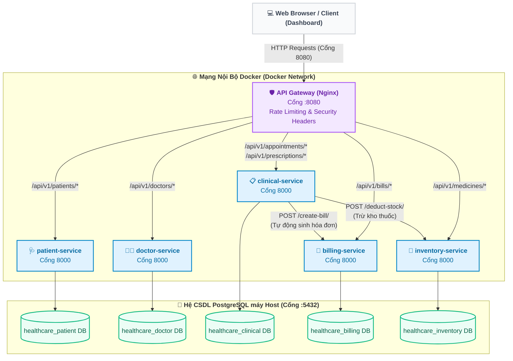

# BÁO CÁO PHÂN RÃ HỆ THỐNG HEALTHCARE THEO DOMAIN-DRIVEN DESIGN (DDD)

## 1.4 Case Study: Healthcare (Luyện Decomposition)

### 1.4.1 Mô tả bài toán
Hệ thống quản lý bệnh viện tích hợp quy trình khám chữa bệnh đa dịch vụ, bao gồm:
* **Quản lý bệnh nhân:** Lưu trữ hồ sơ hành chính, thông tin liên lạc và tiểu sử của bệnh nhân.
* **Quản lý bác sĩ:** Quản lý thông tin cá nhân, chuyên khoa khám chữa bệnh của đội ngũ y bác sĩ.
* **Quản lý lâm sàng & Lịch hẹn:** Tiếp nhận đăng ký, đặt lịch khám giữa bệnh nhân và bác sĩ; thực hiện chuẩn đoán và kê đơn thuốc (Prescription) sau khi khám.
* **Quản lý kho thuốc:** Lưu trữ danh mục thuốc, quản lý tồn kho và ghi nhận lịch sử nhập xuất thuốc.
* **Quản lý hóa đơn:** Tạo và theo dõi hóa đơn viện phí, tiền khám và tiền thuốc của bệnh nhân, hỗ trợ thanh toán viện phí.

---

### 1.4.2 Bước 1: Xác định Domain & Subdomains
Hệ thống được phân tích thành các phân miền nghiệp vụ (Subdomains):
* **Core Domain (Miền cốt lõi):**
  * *Clinical Management & Prescriptions* (Lâm sàng & Kê đơn): Trọng tâm vận hành của bệnh viện, quyết định chất lượng khám chữa bệnh.
  * *Appointment Scheduling* (Quản lý đặt lịch khám): Cầu nối tương tác chính giữa bệnh nhân và bác sĩ.
* **Supporting Domain (Miền hỗ trợ):**
  * *Patient Management* (Quản lý bệnh nhân): Hỗ trợ lưu trữ hồ sơ bệnh án.
  * *Doctor Management* (Quản lý bác sĩ): Quản lý nguồn nhân lực chuyên môn.
* **Generic Domain (Miền chung):**
  * *Inventory Management* (Quản lý kho thuốc): Nghiệp vụ kho phổ thông.
  * *Billing & Payment* (Hóa đơn & Thanh toán): Nghiệp vụ kế toán tài chính phổ thông.

---

### 1.4.3 Bước 2: Xác định Bounded Context
Mỗi phân miền nghiệp vụ được cô lập trong một ngữ cảnh ranh giới (Bounded Context) rõ ràng với cơ sở dữ liệu riêng biệt:
1. **Patient Context:** Quản lý thông tin thực thể `Patient`. CSDL: `healthcare_patient`.
2. **Doctor Context:** Quản lý thông tin thực thể `Doctor`. CSDL: `healthcare_doctor`.
3. **Clinical Context:** Quản lý thực thể `Appointment` (Lịch hẹn) và `Prescription` (Đơn thuốc). CSDL: `healthcare_clinical`.
4. **Inventory Context:** Quản lý thực thể `Medicine` (Thuốc) và `StockTransaction` (Giao dịch kho). CSDL: `healthcare_inventory`.
5. **Billing Context:** Quản lý thực thể `Bill` (Hóa đơn) và `BillItem` (Chi tiết hóa đơn). CSDL: `healthcare_billing`.

---

### 1.4.4 Bước 3: Phân rã thành Microservices
Từ các Bounded Context trên, hệ thống được xây dựng thành 5 dịch vụ Microservices độc lập kết nối qua API Gateway (Nginx):
* **Patient Service** (Chạy trên cổng nội bộ `8000`)
* **Doctor Service** (Chạy trên cổng nội bộ `8000`)
* **Clinical Service** (Chạy trên cổng nội bộ `8000`)
* **Inventory Service** (Chạy trên cổng nội bộ `8000`)
* **Billing Service** (Chạy trên cổng nội bộ `8000`)

---

### 1.4.5 Bước 4: Xác định quan hệ (Context Mapping)
Mối quan hệ phối hợp giữa các dịch vụ được thiết kế theo các mô hình sau:
* **Mối quan hệ phụ thuộc (Customer-Supplier):**
  * **Clinical Service (Customer) ──▶ Patient Service & Doctor Service (Suppliers):** Lịch hẹn khám (`Appointment`) cần thông tin định danh bệnh nhân và bác sĩ để xếp lịch.
  * **Clinical Service (Customer) ──▶ Inventory Service (Supplier):** Khi bác sĩ kê đơn thuốc (`Prescription`), Clinical Service gọi Inventory Service để kiểm tra và trừ số lượng thuốc trong kho (`deduct-stock`).
  * **Clinical Service (Customer) ──▶ Billing Service (Supplier):** Sau khi trừ kho thuốc thành công, Clinical Service gọi Billing Service để tạo hóa đơn viện phí và tiền thuốc (`create-bill`) cho bệnh nhân.
* **Cơ chế giao tiếp:**
  * Đồng bộ (Synchronous) qua giao thức **HTTP REST API** nội bộ giữa các container trong cùng mạng Docker Network.

---

### 1.4.6 Ví dụ API (End-to-End API Flow)

#### 1. Gọi trực tiếp từ Client qua Gateway (Cổng 8080)
* **Lấy danh sách bệnh nhân:**
  `GET http://localhost:8080/api/v1/patients/`
* **Lấy danh sách bác sĩ:**
  `GET http://localhost:8080/api/v1/doctors/`
* **Tạo lịch hẹn mới:**
  `POST http://localhost:8080/api/v1/appointments/`
* **Kê đơn thuốc (Clinical):**
  `POST http://localhost:8080/api/v1/prescriptions/`

#### 2. Kênh gọi nội bộ liên dịch vụ (Internal REST API calls)
Khi thực hiện kê đơn thuốc ở `clinical-service`, dịch vụ này tự động gọi các API nội bộ của các service khác:
* **Trừ tồn kho thuốc (Gửi tới Inventory Service):**
  `POST http://inventory-service:8000/api/v1/internal/deduct-stock/`
* **Tạo hóa đơn tự động (Gửi tới Billing Service):**
  `POST http://billing-service:8000/api/v1/internal/create-bill/`

---

### 1.4.7 Sơ đồ cấu trúc hệ thống (System Architecture Diagram)

Dưới đây là sơ đồ cấu trúc hệ thống Healthcare trực quan hóa bằng Mermaid, thể hiện rõ vai trò định tuyến của API Gateway Nginx, ranh giới mạng cô lập Docker Network, các Microservices backend, mối quan hệ gọi API nội bộ, và cấu trúc cơ sở dữ liệu Database-per-Service:

---

## 1.5 Kết luận
* **Monolithic (Kiến trúc đơn khối):** Phù hợp cho các hệ thống quản lý bệnh viện quy mô nhỏ, phòng khám tư nhân với lưu lượng truy cập thấp vì dễ triển khai và vận hành nhanh chóng.
* **Microservices (Kiến trúc vi dịch vụ):** Phù hợp cho các hệ thống bệnh viện lớn hoặc chuỗi bệnh viện đa khoa có lưu lượng giao dịch cao. Giúp hệ thống tránh lỗi dây chuyền (ví dụ: nếu `inventory-service` bị lỗi, bệnh nhân vẫn có thể đăng ký khám và tra cứu thông tin bình thường tại `patient-service`).
* **Domain-Driven Design (DDD):** Là phương pháp luận quan quan trọng hàng đầu giúp đội ngũ thiết kế phân rã hệ thống y tế phức tạp thành các Bounded Context rõ ràng, tránh tạo ra một "Distributed Monolith" (Kiến trúc đơn khối phân tán) gây hỗn loạn giao tiếp API.
